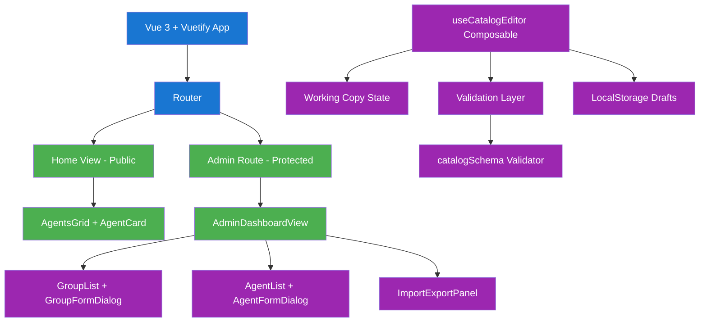
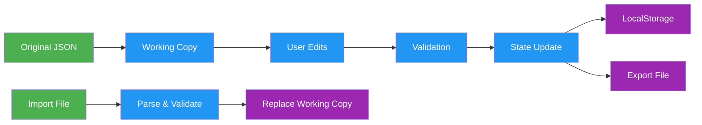

# Admin Panel for Agents Management - Implementation Guide

## Overview

This document outlines the implementation of an admin panel for managing the agents catalog in a Vue 3 + Vuetify application. The panel provides CRUD operations, validation, reordering, and import/export functionality while maintaining a working copy pattern for safe editing.

## Architecture Overview



## Implementation Roadmap

### Phase 1: Foundation (Tasks T01-T10)
✅ **Schema & Validation** - JSON schema for data integrity
✅ **Authentication** - Basic secret-key gate
✅ **State Management** - Working copy with persistence
🔄 **Quality Gates** - Refinement and security scans

### Phase 2: UI Components (Tasks T11-T17)
⏳ **Dashboard Layout** - Tabbed interface
⏳ **CRUD Components** - Lists and forms for groups/agents
⏳ **Drag & Drop** - Reordering functionality
⏳ **Import/Export** - File handling

### Phase 3: Integration (Tasks T18-T19)
⏳ **Component Wiring** - Connect all components
⏳ **Preview Mode** - Live preview in main catalog

### Phase 4: Quality Assurance (Tasks T20-T24)
⏳ **Testing** - Unit, E2E, and integration tests
⏳ **Refinement** - Code quality and accessibility
⏳ **Documentation** - User and deployment guides

## Key Design Decisions

### 🔐 Authentication
- **Frontend-only gate** comparing user input to `VITE_ADMIN_SECRET`
- **Session-based** access control
- **No backend** required (static deployment compatible)

### 💾 Data Management
- **Working copy pattern** for safe editing
- **Optional LocalStorage** drafts (debounced saves)
- **Import/Export workflow** for deployment

### ✅ Validation Strategy
- **JSON Schema** for structural validation
- **Real-time feedback** in forms
- **Unique constraint** enforcement
- **User-friendly error messages**

### 🎨 UI/UX Patterns
- **Vuetify components** for consistency
- **Responsive design** (mobile-friendly)
- **Loading states** and error handling
- **Confirmation dialogs** for destructive actions

## Component Hierarchy

```
src/
├── views/
│   ├── AdminLoginView.vue          # Authentication gate
│   └── AdminDashboardView.vue      # Main admin interface
├── components/
│   └── admin/
│       ├── GroupList.vue           # Groups data table
│       ├── GroupFormDialog.vue     # Group CRUD form
│       ├── AgentList.vue           # Agents data table
│       ├── AgentFormDialog.vue     # Agent CRUD form
│       └── ImportExportPanel.vue   # File operations
├── composables/
│   ├── useAgents.js                # Original catalog loader
│   └── useCatalogEditor.js         # Admin state management
└── utils/
    └── catalogSchema.js            # Validation utilities
```

## Data Flow



## State Management

The `useCatalogEditor` composable manages:

- **Reactive state**: Groups and agents arrays
- **CRUD operations**: Add, update, delete functions
- **Validation**: Schema-based validation with error reporting
- **Persistence**: Optional LocalStorage drafts
- **Import/Export**: JSON serialization and parsing
- **Reordering**: Array manipulation for groups and agents

## Security Considerations

⚠️ **Important**: This implementation uses frontend-only authentication suitable for basic access control.

### Implemented Security
- ✅ Input sanitization
- ✅ Schema validation prevents malformed data
- ✅ No sensitive data logging
- ✅ File upload validation

### Limitations
- ⚠️ Secret visible in client-side code
- ⚠️ No server-side session management
- ⚠️ Suitable for low-risk environments only

## Deployment Workflow

1. **Development**: Use admin panel to edit catalog
2. **Export**: Download modified catalog as JSON
3. **Deploy**: Replace `public/agents_catalog.json` with exported file
4. **Verify**: Test changes in production

## Testing Strategy

### Unit Tests
- Component rendering and interactions
- Composable logic and state management
- Validation functions
- Utility functions

### Integration Tests
- Component communication
- State persistence
- Import/export functionality

### E2E Tests
- Complete user workflows
- Authentication flow
- CRUD operations

## Performance Optimizations

- **Reactive optimization**: Computed properties for filtered data
- **Debounced saves**: LocalStorage writes batched
- **Lazy validation**: Real-time but not blocking
- **Memory management**: Cleanup on unmount

## Error Handling

- **Network errors**: Retry logic with user feedback
- **Validation errors**: Field-level and form-level messages
- **File errors**: Upload/download failure handling
- **State errors**: Recovery from corrupted drafts

## Accessibility (A11y)

- **Keyboard navigation**: Full keyboard support
- **Screen readers**: Proper ARIA labels and roles
- **Color contrast**: Vuetify's accessible color palette
- **Focus management**: Logical tab order and focus trapping

## Browser Support

- **Modern browsers**: Chrome, Firefox, Safari, Edge
- **Vue 3 requirements**: ES2020+ support
- **Vuetify 3**: Modern browser features required

## Development Setup

```bash
# Install dependencies
npm install

# Development server
npm run dev

# Set admin secret (create .env file)
VITE_ADMIN_SECRET=your-secret-key-here

# Run tests
npm run test

# Build for production
npm run build
```

## References

- 📊 **[Architecture Diagrams](./docs/diagrams/architecture.md)**
- 🔄 **[Data Flow Diagrams](./docs/diagrams/data-flow.md)**
- ⏱️ **[Sequence Diagrams](./docs/diagrams/sequence.md)**
- 🔗 **[Component Interactions](./docs/diagrams/component-interaction.md)**
- 🎯 **[State Diagrams](./docs/diagrams/state.md)**
- 🎓 **[Beneficios usados por estudiante (cu93)](./docs/diagrams/benefit-list-used-by-student-sequence.md)**
- 📚 **[Beneficios usados paginados (cu109)](./docs/diagrams/benefit-list-used-paginated-sequence.md)**
- 📑 **[Beneficios con uso solicitado paginados (cu108)](./docs/diagrams/benefit-list-use-requested-paginated-sequence.md)**
- 📈 **[Listado paginado de cajas de ahorro (cu106)](./docs/diagrams/saving-account-list-paginated-sequence.md)**
- ⏰ **[Actualización diaria de cajas de ahorro (cu107)](./docs/diagrams/saving-account-update-sequence.md)**
- 💹 **[Cálculo total invertido (cu110)](./docs/diagrams/investment-total-invested-sequence.md)**
- 🏦 **[Retiro de caja de ahorro (cu104)](./docs/diagrams/saving-account-withdrawal-sequence.md)**
- 🗑️ **[Eliminación de caja de ahorro (cu105)](./docs/diagrams/saving-account-delete-sequence.md)**

- 📋 **[Task Breakdown](./docs/tasks.json)**
- 🎯 **[Feature Brief](./docs/feature_brief.md)**
- 💬 **[Requirements](./docs/clarification_notes.md)**

---

*Implementation Guide - Admin Panel for Agents Management*
