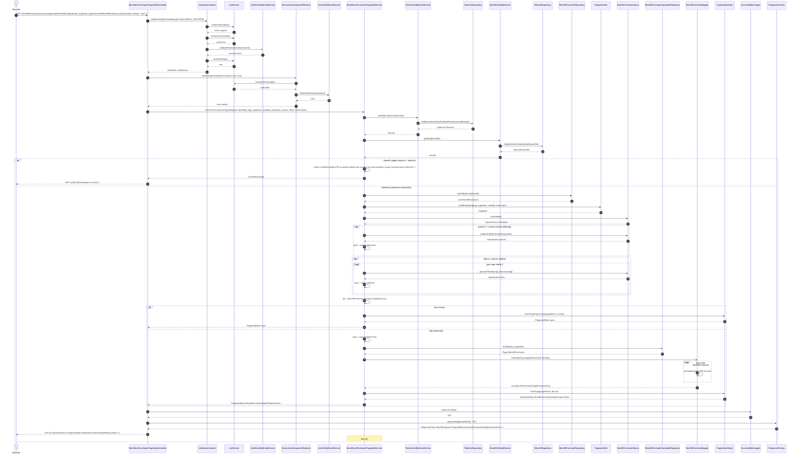

```mermaid
%%{init: {'version': '11.12.1'}}%%
sequenceDiagram
    autonumber
    actor Docente
    participant C as BenefitListPurchasesPaginatedController
    participant JSA as JwtSessionAspect
    participant JS as JwtService
    participant UEA as UserExistsByEmailService
    participant SUAR as SessionUserArgumentResolver
    participant UG as UserGetByEmailService
    participant BLS as BenefitListPurchasesPaginatedService
    participant TGBE as TeacherGetByEmailService
    participant TR as ITeacherRepository
    participant BGBI as BenefitGetByIdService
    participant BR as IBenefitRepository
    participant BPR as IBenefitPurchaseRepository
    participant PU as PaginatorUtils
    participant BPS as BenefitPurchasesSpecs
    participant BPRP as IBenefitPurchasePaginatedRepository
    participant BPM as BenefitPurchaseMapper
    participant PH as PaginationHelper
    participant SM as SuccessfulMessages
    participant RF as ResponseFactory

    Docente->>C: GET /benefits/teacher/purchases/paginated/{benefitId}?page&order_by&order_type&search&filters&filtersValues [Authorization: Bearer "<jwt>"]
    C->>JSA: validateJwt(@SessionRequired roles={ROLE_TEACHER})
    JSA->>JS: isTokenExpired(jwt)
    JS-->>JSA: token vigente
    JSA->>JS: extractUsername(jwt)
    JS-->>JSA: username
    JSA->>UEA: validateIfUserIsActive(username)
    UEA-->>JSA: usuario activo
    JSA->>JS: extractRole(jwt)
    JS-->>JSA: role
    JSA-->>C: validación satisfactoria

    C->>SUAR: resolveArgument(@SessionUser User user)
    SUAR->>JS: extractUsername(jwt)
    JS-->>SUAR: username
    SUAR->>UG: findUserByEmail(username)
    UG-->>SUAR: User
    SUAR-->>C: User sesión

    C->>BLS: cu101ListPurchasesPaginated(user, benefitId, page, pageSize, orderBy, orderType, search, filters, filtersValues)
    BLS->>TGBE: getByEmail(user.getEmail())
    TGBE->>TR: findByUserEmailAndDeletedAtIsNull(user.getEmail())
    TR-->>TGBE: Optional<Teacher>
    TGBE-->>BLS: Teacher

    BLS->>BGBI: getById(benefitId)
    BGBI->>BR: findByIdAndDeletedAtIsNull(benefitId)
    BR-->>BGBI: Optional<Benefit>
    BGBI-->>BLS: Benefit

    alt benefit.subject.teacher != teacher
        BLS->>BLS: throw ConflictException("No se puede obtener las compras de este beneficio ya que no pertenece al docente.")
        BLS-->>C: ConflictException
        C-->>Docente: 409 Conflict (BaseResponse errores)
    else beneficio pertenece al docente
        BLS->>BPR: findAllByBenefit(benefit)
        BPR-->>BLS: List<BenefitPurchase>
        BLS->>PU: buildPageable(page, pageSize, orderBy, orderType)
        PU-->>BLS: Pageable
        BLS->>BPS: notDeleted()
        BPS-->>BLS: Specification notDeleted
        opt search != null && !search.isBlank()
            BLS->>BPS: studentFullNameContains(search)
            BPS-->>BLS: Specification search
            BLS->>BLS: spec = spec.and(search)
        end
        opt filtros y valores válidos
            loop por cada índice i
                BLS->>BPS: genericFilter(filters[i], filtersValues[i])
                BPS-->>BLS: Specification filtro
                BLS->>BLS: spec = spec.and(filtro)
            end
        end
        BLS->>BLS: ids = benefitPurchases.stream().map(id).toList()
        alt ids vacíos
            BLS->>PH: fromPage(Page.empty(pageable), List.of())
            PH-->>BLS: PaginatedData vacío
            BLS-->>C: PaginatedData vacío
        else ids presentes
            BLS->>BLS: spec = spec.and(id IN ids)
            BLS->>BPRP: findAll(spec, pageable)
            BPRP-->>BLS: Page<BenefitPurchase>
            BLS->>BPM: toSimpleDtoList(pageResult.getContent())
            loop por cada BenefitPurchase
                BPM->>BPM: toSimpleDto(benefitPurchase)
            end
            BPM-->>BLS: List<BenefitPurchaseSimpleResponseDto>
            BLS->>PH: fromPage(pageResult, dtoList)
            PH-->>BLS: PaginatedData<BenefitPurchaseSimpleResponseDto>
            BLS-->>C: PaginatedData<BenefitPurchaseSimpleResponseDto>
        end
        C->>SM: okSuccessfully()
        SM-->>C: "OK"
        C->>RF: paginated(paginatedData, "OK")
        RF-->>C: ResponseEntity<BaseResponse<PaginatedData<BenefitPurchaseSimpleResponseDto>>>
        C-->>Docente: 200 OK (BaseResponse<PaginatedData<BenefitPurchaseSimpleResponseDto>>)
        note over BLS: finCU()
    end
```

