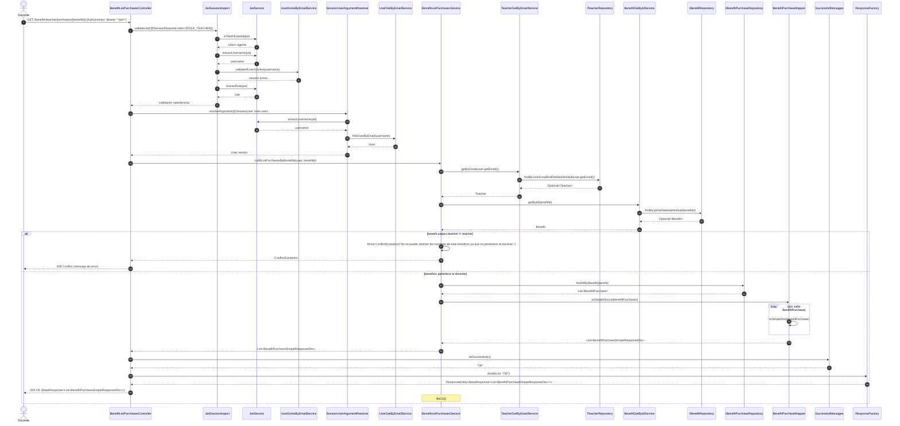

```mermaid
%%{init: {'version': '11.12.1'}}%%
sequenceDiagram
    autonumber
    actor Docente
    participant C as BenefitListPurchasesController
    participant JSA as JwtSessionAspect
    participant JS as JwtService
    participant UEA as UserExistsByEmailService
    participant SUAR as SessionUserArgumentResolver
    participant UG as UserGetByEmailService
    participant BLS as BenefitListPurchasesService
    participant TGBE as TeacherGetByEmailService
    participant TR as ITeacherRepository
    participant BGBI as BenefitGetByIdService
    participant BR as IBenefitRepository
    participant BPR as IBenefitPurchaseRepository
    participant BPM as BenefitPurchaseMapper
    participant SM as SuccessfulMessages
    participant RF as ResponseFactory

    Docente->>C: GET /benefits/teacher/purchases/{benefitId} [Authorization: Bearer "<jwt>"]
    C->>JSA: validateJwt(@SessionRequired roles={ROLE_TEACHER})
    JSA->>JS: isTokenExpired(jwt)
    JS-->>JSA: token vigente
    JSA->>JS: extractUsername(jwt)
    JS-->>JSA: username
    JSA->>UEA: validateIfUserIsActive(username)
    UEA-->>JSA: usuario activo
    JSA->>JS: extractRole(jwt)
    JS-->>JSA: role
    JSA-->>C: validación satisfactoria

    C->>SUAR: resolveArgument(@SessionUser User user)
    SUAR->>JS: extractUsername(jwt)
    JS-->>SUAR: username
    SUAR->>UG: findUserByEmail(username)
    UG-->>SUAR: User
    SUAR-->>C: User sesión

    C->>BLS: cu98ListPurchasesByBenefitId(user, benefitId)
    BLS->>TGBE: getByEmail(user.getEmail())
    TGBE->>TR: findByUserEmailAndDeletedAtIsNull(user.getEmail())
    TR-->>TGBE: Optional<Teacher>
    TGBE-->>BLS: Teacher

    BLS->>BGBI: getById(benefitId)
    BGBI->>BR: findByIdAndDeletedAtIsNull(benefitId)
    BR-->>BGBI: Optional<Benefit>
    BGBI-->>BLS: Benefit

    alt benefit.subject.teacher != teacher
        BLS->>BLS: throw ConflictException("No se puede obtener las compras de este beneficio ya que no pertenece al docente.")
        BLS-->>C: ConflictException
        C-->>Docente: 409 Conflict (mensaje de error)
    else beneficio pertenece al docente
        BLS->>BPR: findAllByBenefit(benefit)
        BPR-->>BLS: List<BenefitPurchase>
        BLS->>BPM: toSimpleDtoList(benefitPurchases)
        loop por cada BenefitPurchase
            BPM->>BPM: toSimpleDto(benefitPurchase)
        end
        BPM-->>BLS: List<BenefitPurchaseSimpleResponseDto>
        BLS-->>C: List<BenefitPurchaseSimpleResponseDto>
        C->>SM: okSuccessfully()
        SM-->>C: "OK"
        C->>RF: ok(dtoList, "OK")
        RF-->>C: ResponseEntity<BaseResponse<List<BenefitPurchaseSimpleResponseDto>>>
        C-->>Docente: 200 OK (BaseResponse<List<BenefitPurchaseSimpleResponseDto>>)
        note over BLS: finCU()
    end


```
