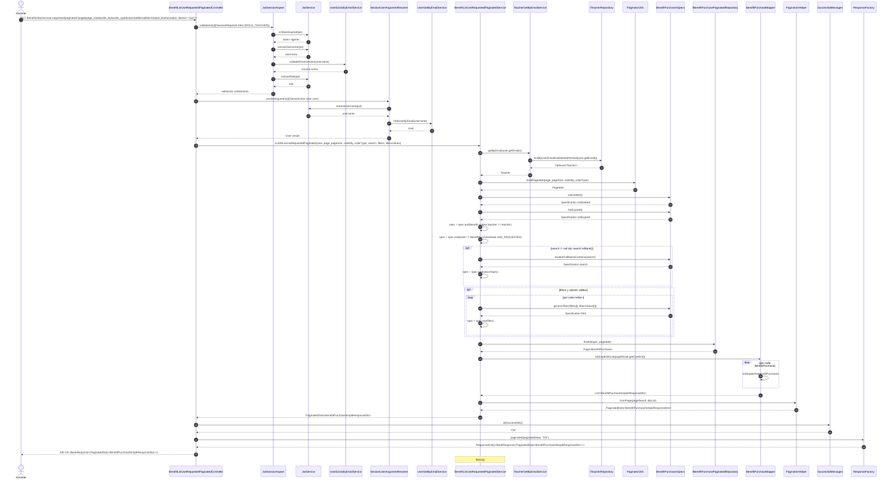

```mermaid
%%{init: {'version': '11.12.1'}}%%
sequenceDiagram
    autonumber
    actor Docente
    participant C as BenefitListUseRequestedPaginatedController
    participant JSA as JwtSessionAspect
    participant JS as JwtService
    participant UEA as UserExistsByEmailService
    participant SUAR as SessionUserArgumentResolver
    participant UG as UserGetByEmailService
    participant BLURPS as BenefitListUseRequestedPaginatedService
    participant TGBE as TeacherGetByEmailService
    participant TR as ITeacherRepository
    participant PU as PaginatorUtils
    participant BPS as BenefitPurchasesSpecs
    participant BPRP as IBenefitPurchasePaginatedRepository
    participant BPM as BenefitPurchaseMapper
    participant PH as PaginationHelper
    participant SM as SuccessfulMessages
    participant RF as ResponseFactory

    Docente->>C: GET /benefits/teacher/use-requested/paginated?page&page_size&order_by&order_type&search&filters&filtersValues [Authorization: Bearer "<jwt>"]
    C->>JSA: validateJwt(@SessionRequired roles={ROLE_TEACHER})
    JSA->>JS: isTokenExpired(jwt)
    JS-->>JSA: token vigente
    JSA->>JS: extractUsername(jwt)
    JS-->>JSA: username
    JSA->>UEA: validateIfUserIsActive(username)
    UEA-->>JSA: usuario activo
    JSA->>JS: extractRole(jwt)
    JS-->>JSA: role
    JSA-->>C: validación satisfactoria

    C->>SUAR: resolveArgument(@SessionUser User user)
    SUAR->>JS: extractUsername(jwt)
    JS-->>SUAR: username
    SUAR->>UG: findUserByEmail(username)
    UG-->>SUAR: User
    SUAR-->>C: User sesión

    C->>BLURPS: cu108ListUseRequestedPaginated(user, page, pageSize, orderBy, orderType, search, filters, filtersValues)
    BLURPS->>TGBE: getByEmail(user.getEmail())
    TGBE->>TR: findByUserEmailAndDeletedAtIsNull(user.getEmail())
    TR-->>TGBE: Optional<Teacher>
    TGBE-->>BLURPS: Teacher

    BLURPS->>PU: buildPageable(page, pageSize, orderBy, orderType)
    PU-->>BLURPS: Pageable

    BLURPS->>BPS: notDeleted()
    BPS-->>BLURPS: Specification notDeleted
    BLURPS->>BPS: notExpired()
    BPS-->>BLURPS: Specification notExpired
    BLURPS->>BLURPS: spec = spec.and(benefit.subject.teacher == teacher)
    BLURPS->>BLURPS: spec = spec.and(state == BenefitPurchaseState.USE_REQUESTED)

    opt search != null && !search.isBlank()
        BLURPS->>BPS: studentFullNameContains(search)
        BPS-->>BLURPS: Specification search
        BLURPS->>BLURPS: spec = spec.and(searchSpec)
    end

    opt filtros y valores válidos
        loop por cada índice i
            BLURPS->>BPS: genericFilter(filters[i], filtersValues[i])
            BPS-->>BLURPS: Specification filtro
            BLURPS->>BLURPS: spec = spec.and(filtro)
        end
    end

    BLURPS->>BPRP: findAll(spec, pageable)
    BPRP-->>BLURPS: Page<BenefitPurchase>

    BLURPS->>BPM: toSimpleDtoList(pageResult.getContent())
    loop por cada BenefitPurchase
        BPM->>BPM: toSimpleDto(benefitPurchase)
    end
    BPM-->>BLURPS: List<BenefitPurchaseSimpleResponseDto>

    BLURPS->>PH: fromPage(pageResult, dtoList)
    PH-->>BLURPS: PaginatedData<BenefitPurchaseSimpleResponseDto>
    BLURPS-->>C: PaginatedData<BenefitPurchaseSimpleResponseDto>

    C->>SM: okSuccessfully()
    SM-->>C: "OK"
    C->>RF: paginated(paginatedData, "OK")
    RF-->>C: ResponseEntity<BaseResponse<PaginatedData<BenefitPurchaseSimpleResponseDto>>>
    C-->>Docente: 200 OK (BaseResponse<PaginatedData<BenefitPurchaseSimpleResponseDto>>)
    note over BLURPS: finCU()
```

