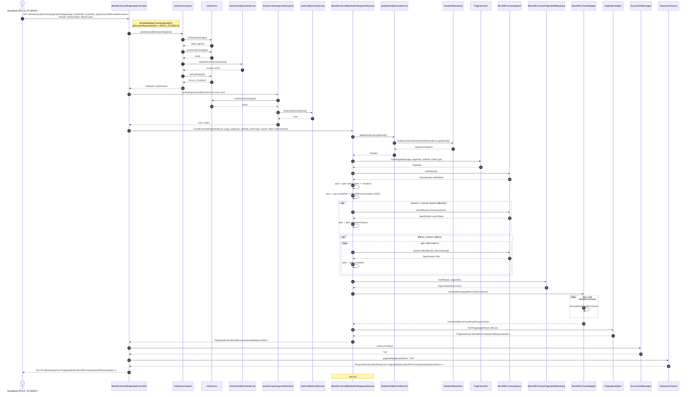

```mermaid
%%{init: {'version': '11.12.1'}}%%
sequenceDiagram
    autonumber
    actor ST as Estudiante (ROLE_STUDENT)
    participant C as BenefitListUsedPaginatedController
    participant JSA as JwtSessionAspect
    participant JS as JwtService
    participant UEA as UserExistsByEmailService
    participant SUAR as SessionUserArgumentResolver
    participant UGBE as UserGetByEmailService
    participant BLUBPS as BenefitListUsedByStudentPaginatedService
    participant SGES as StudentGetByEmailService
    participant SR as IStudentRepository
    participant PU as PaginatorUtils
    participant BPS as BenefitPurchasesSpecs
    participant BPRP as IBenefitPurchasePaginatedRepository
    participant BPM as BenefitPurchaseMapper
    participant PH as PaginationHelper
    participant SM as SuccessfulMessages
    participant RF as ResponseFactory

    ST->>C: GET /benefits/student/used/paginated?page&page_size&order_by&order_type&search&filters&filtersValues<br/>Header: Authorization: Bearer {jwt}
    Note right of C: @GetMapping("/used/paginated")<br/>@SessionRequired(roles = {ROLE_STUDENT})

    C->>JSA: validateJwt(@SessionRequired)
    JSA->>JS: isTokenExpired(jwt)
    JS-->>JSA: token vigente
    JSA->>JS: extractUsername(jwt)
    JS-->>JSA: email
    JSA->>UEA: validateIfUserIsActive(email)
    UEA-->>JSA: usuario activo
    JSA->>JS: extractRole(jwt)
    JS-->>JSA: ROLE_STUDENT
    JSA-->>C: validación satisfactoria

    C->>SUAR: resolveArgument(@SessionUser User user)
    SUAR->>JS: extractUsername(jwt)
    JS-->>SUAR: email
    SUAR->>UGBE: findUserByEmail(email)
    UGBE-->>SUAR: User
    SUAR-->>C: User sesión

    C->>BLUBPS: cu109ListUsedPaginated(user, page, pageSize, orderBy, orderType, search, filters, filtersValues)
    BLUBPS->>SGES: getByEmail(user.getEmail())
    SGES->>SR: findByUserEmailAndDeletedAtIsNull(user.getEmail())
    SR-->>SGES: Optional<Student>
    SGES-->>BLUBPS: Student

    BLUBPS->>PU: buildPageable(page, pageSize, orderBy, orderType)
    PU-->>BLUBPS: Pageable

    BLUBPS->>BPS: notDeleted()
    BPS-->>BLUBPS: Specification notDeleted
    BLUBPS->>BLUBPS: spec = spec.and(student == Student)
    BLUBPS->>BLUBPS: spec = spec.and(state == BenefitPurchaseState.USED)

    opt search != null && !search.isBlank()
        BLUBPS->>BPS: benefitNameContains(search)
        BPS-->>BLUBPS: Specification searchSpec
        BLUBPS->>BLUBPS: spec = spec.and(searchSpec)
    end

    opt filtros y valores válidos
        loop por cada índice i
            BLUBPS->>BPS: genericFilter(filters[i], filtersValues[i])
            BPS-->>BLUBPS: Specification filtro
            BLUBPS->>BLUBPS: spec = spec.and(filtro)
        end
    end

    BLUBPS->>BPRP: findAll(spec, pageable)
    BPRP-->>BLUBPS: Page<BenefitPurchase>

    BLUBPS->>BPM: toUsedDtoList(pageResult.getContent())
    loop por cada BenefitPurchase
        BPM->>BPM: toUsedDto(benefitPurchase)
    end
    BPM-->>BLUBPS: List<BenefitPurchasedUsedResponseDto>

    BLUBPS->>PH: fromPage(pageResult, dtoList)
    PH-->>BLUBPS: PaginatedData<BenefitPurchasedUsedResponseDto>
    BLUBPS-->>C: PaginatedData<BenefitPurchasedUsedResponseDto>

    C->>SM: okSuccessfully()
    SM-->>C: "OK"
    C->>RF: paginated(paginatedData, "OK")
    RF-->>C: ResponseEntity<BaseResponse<PaginatedData<BenefitPurchasedUsedResponseDto>>>
    C-->>ST: 200 OK (BaseResponse<PaginatedData<BenefitPurchasedUsedResponseDto>>)
    note over BLUBPS: finCU()

```

