# Diagrama de Secuencia: Registro de Plazo Fijo

Este diagrama muestra el flujo completo del endpoint `POST /investment/fixed-term-deposit`, desde el controlador `FixedTermDepositRegisterController` hasta todas las capas involucradas.

```mermaid
%%{init: {'version': '11.12.1'}}%%
sequenceDiagram
    autonumber
    actor U as User (Estudiante)
    participant C as FixedTermDepositRegisterController
    participant Svc as FixedTermDepositRegisterService
    participant StuSvc as IStudentGetByEmailService
    participant Stu as Student
    participant Wal as Wallet
    participant IntSvc as IFixedTermDepositCalculateInterestService
    participant M as FixedTermDepositMapper
    participant Repo as IFixedTermDepositRepository
    participant FTD as FixedTermDeposit
    participant TxGen as ITransactionGenerateService
    participant TxStrat as FixedTermDepositTransactionService
    participant TxRepo as ITransactionRepository
    participant TxM as TransactionMapper
    participant Tx as Transaction
    participant ResFind as IReserveFindLastService
    participant Res as Reserve
    participant WalRem as IWalletRemoveAmountService
    participant WalRepo as IWalletRepository
    participant ResMod as IReserveModifyService
    participant ResRepo as IReserveRepository
    participant WalUpd as IWalletUpdateInvestedBalanceService
    participant InvCalc as IInvestmentCalculateTotalInvestedService
    participant FTDCalc as IFixedTermDepositCalculateAmountInvestedService
    participant FTDRepo2 as IFixedTermDepositRepository
    participant Resp as ResponseFactory

    U->>C: POST /investment/fixed-term-deposit<br/>body: FixedTermDepositRegisterRequestDto<br/>(amountInvested, fixedTermDays)
    Note right of C: @SessionRequired(ROLE_STUDENT)<br/>@SessionUser User user
    C->>Svc: cu92registerFixedTermDeposit(dto, user)

    Svc->>StuSvc: getByEmail(user.getEmail())
    StuSvc-->>Svc: Student
    Svc->>Stu: getWallet()
    Stu-->>Svc: Wallet
    Svc->>Wal: getBalance()
    Wal-->>Svc: Double balance
    
    alt balance < amountInvested
        Svc-->>C: throw UnsupportedOperationException<br/>("No hay saldo suficiente en la wallet")
        C-->>U: 400/409 Bad Request
    else balance >= amountInvested
        Svc->>IntSvc: execute(amountInvested, fixedTermDays)
        IntSvc-->>Svc: Double interest
        
        Svc->>Svc: amountReward = amountInvested + interest<br/>endDate = LocalDate.now().plusDays(fixedTermDays.getValor())
        
        Svc->>M: toEntity(dto, amountReward, LocalDate.now(), endDate, wallet, FixedTermState.IN_PROGRESS)
        M-->>Svc: FixedTermDeposit
        
        Svc->>Repo: save(FixedTermDeposit)
        Repo->>FTD: persist
        FTD-->>Repo: FixedTermDeposit (con id)
        Repo-->>Svc: FixedTermDeposit
        
        Svc->>TxGen: generate(TypeTransaction.PLAZO_FIJO, amountInvested, "Inversion en plazo fijo.", TransactionActor.ESTUDIANTE, TransactionActor.SISTEMA, wallet, null, null, null, null, fixedTermDeposit, null)
        
        TxGen->>TxGen: validate amount > 0
        TxGen->>TxGen: strategies.get("PLAZO_FIJO")
        TxGen->>TxStrat: execute(amountInvested, "Inversion en plazo fijo.", TransactionActor.ESTUDIANTE, TransactionActor.SISTEMA, wallet, null, null, null, null, fixedTermDeposit, null)
        
        TxStrat->>ResFind: get()
        ResFind-->>TxStrat: Reserve
        
        TxStrat->>TxStrat: fixedTermDeposit.getFixedTermState() == IN_PROGRESS
        
        TxStrat->>TxStrat: validate amount <= wallet.getBalance()
        
        TxStrat->>TxM: toModel(amountInvested, "Inversion en plazo fijo.", TransactionActor.ESTUDIANTE, TransactionActor.SISTEMA, wallet, null, null, null, null, fixedTermDeposit, null, reserve)
        TxM-->>TxStrat: Transaction
        
        TxStrat->>TxRepo: save(Transaction)
        TxRepo->>Tx: persist
        Tx-->>TxRepo: Transaction (con id)
        TxRepo-->>TxStrat: Transaction
        
        TxStrat->>WalRem: execute(wallet, amountInvested)
        WalRem->>Wal: setBalance(balance - amountInvested)
        WalRem->>WalRepo: save(wallet)
        WalRepo-->>WalRem: Wallet
        WalRem-->>TxStrat: Wallet
        
        TxStrat->>ResMod: moveToReserve(amountInvested, reserve)
        ResMod->>Res: setCirculationBalance(circulationBalance - amountInvested)<br/>setReserveBalance(reserveBalance + amountInvested)
        ResMod->>ResRepo: save(reserve)
        ResRepo-->>ResMod: Reserve
        ResMod-->>TxStrat: Reserve
        
        TxStrat-->>TxGen: Transaction
        TxGen-->>Svc: Transaction
        
        Svc->>WalUpd: execute(wallet)
        WalUpd->>InvCalc: cu110calculateTotalInvested(wallet)
        InvCalc->>FTDCalc: execute(wallet)
        FTDCalc->>FTDRepo2: findByFixedTermState(FixedTermState.IN_PROGRESS)
        FTDRepo2-->>FTDCalc: List<FixedTermDeposit>
        FTDCalc->>FTDCalc: sum amountReward for all IN_PROGRESS deposits
        FTDCalc-->>InvCalc: Double (fixedTermDeposit total)
        InvCalc->>InvCalc: sum all investment types
        InvCalc-->>WalUpd: Double (total invested)
        WalUpd->>Wal: setInvertedBalance(totalInvested)
        WalUpd->>WalRepo: save(wallet)
        WalRepo-->>WalUpd: Wallet
        WalUpd-->>Svc: void
        
        Svc->>M: toDto(fixedTermDeposit)
        M-->>Svc: FixedTermDepositResponseDto
        
        Svc-->>C: FixedTermDepositResponseDto
        C->>Resp: created(responseDto, SuccessfulMessages.createdSuccessfully("Plazo fijo"))
        Resp-->>C: ResponseEntity<BaseResponse<FixedTermDepositResponseDto>>
        C-->>U: 201 Created (responseDto)
    end
    
    note over Svc: finCU()
```

