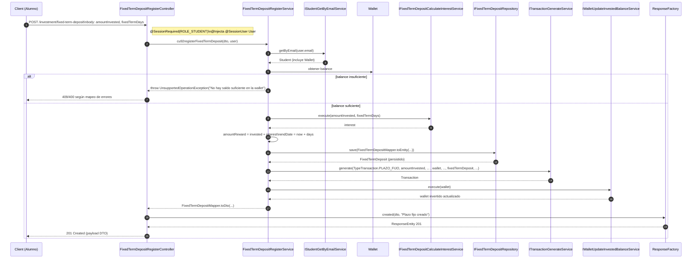
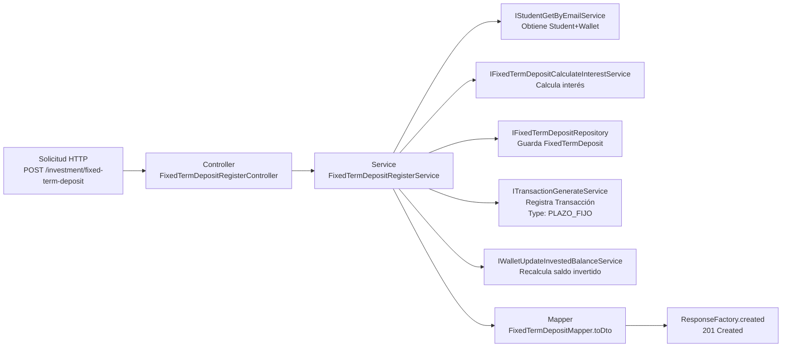

## Flujo: Registro de Plazo Fijo (`cu92registerFixedTermDeposit`)

Este documento describe el flujo completo del endpoint `POST /investment/fixed-term-deposit`, desde el controlador `FixedTermDepositRegisterController` hasta la persistencia y efectos colaterales (generación de transacción y actualización de saldo invertido en la `Wallet`).

### Diagrama de Secuencia

### Diagrama de Flujo de Datos (alto nivel)

### Detalles Clave

- Validación y sesión:
  - `@SessionRequired(roles = {Role.ROLE_STUDENT})` en el controlador asegura que el actor sea un alumno autenticado.
  - `@SessionUser User` inyecta el `User` de sesión.

- Reglas de negocio en `FixedTermDepositRegisterService`:
  - Obtiene la `Wallet` del alumno vía `IStudentGetByEmailService.getByEmail(user.getEmail())`.
  - Verifica saldo suficiente: si `wallet.balance < dto.amountInvested` lanza `UnsupportedOperationException`.
  - Calcula interés: `IFixedTermDepositCalculateInterestService.execute(amount, fixedTermDays)`.
    - Implementación: `FixedTermDepositCalculateRewardAmountService` usa la fórmula `interest = amount * 1.5 * (days/365)`. `FixedTermDays` puede ser `SEMANAL(7)`, `QUINZENAL(15)`, `MENSUAL(30)`.
  - Persiste `FixedTermDeposit` con estado `IN_PROGRESS`, `startDate = now`, `endDate = now + days` usando `IFixedTermDepositRepository.save(...)` y `FixedTermDepositMapper.toEntity(...)`.
  - Genera transacción con `ITransactionGenerateService.generate(...)` de tipo `PLAZO_FIJO`, actor origen `ESTUDIANTE`, destino `SISTEMA`.
  - Actualiza saldo invertido de la `Wallet` con `IWalletUpdateInvestedBalanceService.execute(wallet)` que recalcula `invertedBalance` mediante `IInvestmentCalculateTotalInvestedService.cu110calculateTotalInvested` y persiste la wallet.

- Respuesta:
  - Mapea la entidad a `FixedTermDepositResponseDto` y retorna `201 Created` con mensaje "Plazo fijo" desde `ResponseFactory.created(...)`.

### Referencias de Código

- Controlador: `trinity.play2learn.backend.investment.fixedTermDeposit.controllers.FixedTermDepositRegisterController`
- Servicio: `trinity.play2learn.backend.investment.fixedTermDeposit.services.FixedTermDepositRegisterService`
- Repositorio: `trinity.play2learn.backend.investment.fixedTermDeposit.repositories.IFixedTermDepositRepository`
- Mapper: `trinity.play2learn.backend.investment.fixedTermDeposit.mappers.FixedTermDepositMapper`
- DTOs: request/response en `...fixedTermDeposit.dtos.*`
- Cálculo interés: `...services.commons.FixedTermDepositCalculateRewardAmountService`
- Transacciones: `...economy.transaction.services.TransactionGenerateService`
- Wallet: `...economy.wallet.services.WalletUpdateInvestedBalanceService`

> Actualiza este diagrama si cambian: validaciones, fórmula de interés, estrategia de transacciones, o el pipeline de actualización de `Wallet`.

