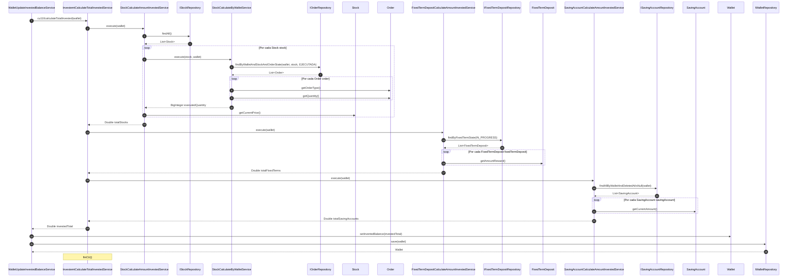

```mermaid
%%{init: {'version': '11.12.1'}}%%
sequenceDiagram
    autonumber
    participant WUBS as WalletUpdateInvestedBalanceService
    participant ITIS as InvestemtCalculateTotalInvestedService
    participant SCAS as StockCalculateAmountInvestedService
    participant SR as IStockRepository
    participant SCBWS as StockCalculateByWalletService
    participant OR as IOrderRepository
    participant STK as Stock
    participant ORD as Order
    participant FTCAS as FixedTermDepositCalculateAmountInvestedService
    participant FTDR as IFixedTermDepositRepository
    participant FTD as FixedTermDeposit
    participant SACAS as SavingAccountCalculateAmountInvestedService
    participant SAR as ISavingAccountRepository
    participant SAV as SavingAccount
    participant WAL as Wallet
    participant WR as IWalletRepository


    WUBS->>ITIS: cu110calculateTotalInvested(wallet)

    ITIS->>SCAS: execute(wallet)
    SCAS->>SR: findAll()
    SR-->>SCAS: List<Stock>
    loop Por cada Stock stock
        SCAS->>SCBWS: execute(stock, wallet)
        SCBWS->>OR: findByWalletAndStockAndOrderState(wallet, stock, EJECUTADA)
        OR-->>SCBWS: List<Order>
        loop Por cada Order order
            SCBWS->>ORD: getOrderType()
            SCBWS->>ORD: getQuantity()
        end
        SCBWS-->>SCAS: BigInteger executedQuantity
        SCAS->>STK: getCurrentPrice()
    end
    SCAS-->>ITIS: Double totalStocks

    ITIS->>FTCAS: execute(wallet)
    FTCAS->>FTDR: findByFixedTermState(IN_PROGRESS)
    FTDR-->>FTCAS: List<FixedTermDeposit>
    loop Por cada FixedTermDeposit fixedTermDeposit
        FTCAS->>FTD: getAmountReward()
    end
    FTCAS-->>ITIS: Double totalFixedTerms

    ITIS->>SACAS: execute(wallet)
    SACAS->>SAR: findAllByWalletAndDeletedAtIsNull(wallet)
    SAR-->>SACAS: List<SavingAccount>
    loop Por cada SavingAccount savingAccount
        SACAS->>SAV: getCurrentAmount()
    end
    SACAS-->>ITIS: Double totalSavingAccounts

    ITIS-->>WUBS: Double investedTotal
    WUBS->>WAL: setInvertedBalance(investedTotal)
    WUBS->>WR: save(wallet)
    WR-->>WUBS: Wallet

    note over ITIS: finCU()
```
