# Diagrama de clases — Entidades y Enums

El siguiente diagrama concentra todas las entidades persistentes y enumeraciones del backend. Solo se muestran relaciones entre entidades y las referencias directas a enums usados en sus atributos. Las enumeraciones de apoyo sin relación directa permanecen aisladas para mantener la visibilidad completa del modelo de dominio.

```mermaid
%%{init: {'version': '11.12.1'}}%%
classDiagram
    direction LR

    %% Actividades
    class Activity {
        <<abstract>>
        +id : Long
        +name : String
        +description : String
        +startDate : LocalDateTime
        +endDate : LocalDateTime
        +createdAt : LocalDateTime
        +deletedAt : LocalDateTime
        +difficulty : Difficulty
        +maxTime : int
        +attempts : int
        +actualBalance : Double
        +initialBalance : Double
        +typeReward : TypeReward
    }
    class ActivityCompleted {
        +id : Long
        +reward : Double
        +remainingAttempts : Integer
        +state : ActivityCompletedState
        +completedAt : LocalDateTime
        +startedAt : LocalDateTime
    }
    class NoLudicaAttempt {
        +id : Long
        +plainText : String
    }
    class NoLudica {
        +id : Long
        +excercise : String
        +tipoEntrega : TipoEntrega
    }
    class Ahorcado {
        +id : Long
        +word : String
        +errorsPermited : Errors
    }
    class ArbolDeDecisionActivity {
        +id : Long
        +introduction : String
    }
    class DecisionArbolDecision {
        +id : Long
        +name : String
        +context : String
    }
    class ConsecuenceArbolDecision {
        +id : Long
        +name : String
        +approvesActivity : boolean
    }
    class ClasificacionActivity {
        +id : Long
    }
    class CategoryClasificacion {
        +id : Long
        +name : String
    }
    class ConceptClasificacion {
        +id : Long
        +name : String
    }
    class CompletarOracionActivity {
        +id : Long
    }
    class SentenceCompletarOracion {
        +id : Long
        +completeSentence : String
        +deletedAt : LocalDateTime
    }
    class WordCompletarOracion {
        +id : Long
        +word : String
        +wordOrder : int
        +isMissing : Boolean
    }
    class Memorama {
        +id : Long
    }
    class CouplesMemorama {
        +id : Long
        +url : String
        +concept : String
    }
    class OrdenarSecuencia {
        +id : Long
    }
    class Event {
        +id : Long
        +order : Integer
        +name : String
        +description : String
        +url : String
    }
    class Preguntados {
        +id : Long
        +maxTimePerQuestion : int
    }
    class Question {
        +id : Long
        +question : String
    }
    class Option {
        +id : Long
        +option : String
        +isCorrect : Boolean
    }

    %% Administración académica
    class Year {
        +id : Long
        +name : String
        +deletedAt : LocalDateTime
    }
    class Course {
        +id : Long
        +name : String
        +deletedAt : LocalDateTime
    }
    class Teacher {
        +id : Long
        +name : String
        +lastname : String
        +dni : String
        +deletedAt : LocalDateTime
    }
    class Subject {
        +id : Long
        +name : String
        +optional : Boolean
        +deletedAt : LocalDateTime
        +actualBalance : Double
        +initialBalance : Double
    }
    class Student {
        +id : Long
        +name : String
        +lastname : String
        +dni : String
        +birthdate : LocalDate
        +emailTutor : String
        +deletedAt : LocalDateTime
    }

    %% Perfil y avatar
    class Profile {
        +id : Long
    }
    class Aspect {
        +id : Long
        +name : String
        +image : String
        +available : boolean
        +price : BigDecimal
        +deletedAt : LocalDateTime
        +type : TypeAspect
    }
    class UploadedFile {
        +id : Long
        +fileName : String
        +uuid : String
        +cdnUrl : String
        +uploadedAt : LocalDateTime
    }

    %% Beneficios
    class Benefit {
        +id : Long
        +name : String
        +description : String
        +cost : Long
        +purchaseLimit : Integer
        +purchasesLeft : Integer
        +purchaseLimitPerStudent : Integer
        +endAt : LocalDateTime
        +icon : BenefitIcon
        +category : BenefitCategory
        +color : BenefitColor
        +deletedAt : LocalDateTime
    }
    class BenefitPurchase {
        +id : Long
        +state : BenefitPurchaseState
        +purchasedAt : LocalDateTime
        +usedAt : LocalDateTime
        +deletedAt : LocalDateTime
    }

    %% Economía
    class Wallet {
        +id : Long
        +balance : Double
        +invertedBalance : Double
    }
    class Reserve {
        +id : Long
        +reserveBalance : Double
        +circulationBalance : Double
        +initialBalance : Double
        +createdAt : LocalDateTime
        +lastUpdateAt : LocalDateTime
    }
    class Transaction {
        +id : Long
        +amount : Double
        +description : String
        +origin : TransactionActor
        +destination : TransactionActor
        +createdAt : LocalDateTime
    }
    class SavingAccount {
        +id : Long
        +initialAmount : Double
        +currentAmount : Double
        +accumulatedInterest : Double
        +name : String
        +startDate : LocalDate
        +lastUpdate : LocalDate
        +deletedAt : LocalDateTime
    }

    %% Inversiones
    class Stock {
        +id : Long
        +name : String
        +abbreviation : String
        +totalAmount : BigInteger
        +availableAmount : BigInteger
        +soldAmount : BigInteger
        +currentPrice : Double
        +initialPrice : Double
        +riskLevel : RiskLevel
    }
    class StockHistory {
        +id : Long
        +price : Double
        +availableAmount : BigInteger
        +soldAmount : BigInteger
        +createdAt : LocalDateTime
        +variation : Double
    }
    class Order {
        +id : Long
        +orderType : OrderType
        +orderState : OrderState
        +orderStop : OrderStop
        +quantity : BigInteger
        +pricePerUnit : Double
        +createdAt : LocalDateTime
    }
    class FixedTermDeposit {
        +id : Long
        +amountInvested : Double
        +amountReward : Double
        +fixedTermDays : FixedTermDays
        +startDate : LocalDate
        +endDate : LocalDate
        +fixedTermState : FixedTermState
    }

    %% Usuarios
    class User {
        +id : Long
        +email : String
        +password : String
        +role : Role
        +deletedAt : LocalDateTime
    }

    %% Relaciones
    Activity "*" --> "1" Subject : subject
    ActivityCompleted "*" --> "1" Activity : activity
    ActivityCompleted "*" --> "1" Student : student
    ActivityCompleted "*" --> "0..1" NoLudicaAttempt : noLudicaAttempt
    NoLudicaAttempt "*" --> "0..1" UploadedFile : file
    Activity <|-- Ahorcado
    Activity <|-- NoLudica
    Activity <|-- Preguntados
    Activity <|-- Memorama
    Activity <|-- ArbolDeDecisionActivity
    Activity <|-- ClasificacionActivity
    Activity <|-- CompletarOracionActivity
    Activity <|-- OrdenarSecuencia
    ArbolDeDecisionActivity "1" --> "*" DecisionArbolDecision : decisionTree
    DecisionArbolDecision "1" --> "*" DecisionArbolDecision : options
    DecisionArbolDecision "*" --> "0..1" ConsecuenceArbolDecision : consecuence
    ClasificacionActivity "1" --> "*" CategoryClasificacion : categories
    CategoryClasificacion "1" --> "*" ConceptClasificacion : concepts
    CompletarOracionActivity "1" --> "*" SentenceCompletarOracion : sentences
    SentenceCompletarOracion "1" --> "*" WordCompletarOracion : words
    Memorama "1" --> "*" CouplesMemorama : couples
    OrdenarSecuencia "1" --> "*" Event : events
    Preguntados "1" --> "*" Question : questions
    Question "1" --> "*" Option : options

    Course "*" --> "1" Year : year
    Student "*" --> "1" Course : course
    Student "1" --> "1" User : user
    Student "1" --> "0..1" Profile : profile
    Student "1" --> "0..1" Wallet : wallet
    Teacher "1" --> "1" User : user
    Subject "*" --> "1" Course : course
    Subject "*" --> "0..1" Teacher : teacher
    Subject "*" --> "*" Student : students

    Profile "1" --> "1" Student : student
    Profile "*" --> "*" Aspect : ownedAspects
    Profile "0..1" --> "1" Aspect : selectedBody
    Profile "0..1" --> "1" Aspect : selectedShirt
    Profile "0..1" --> "1" Aspect : selectedHat

    Benefit "*" --> "1" Subject : subject
    BenefitPurchase "*" --> "1" Student : student
    BenefitPurchase "*" --> "1" Benefit : benefit

    Wallet "1" --> "1" Student : student
    Reserve "1" --> "*" Transaction : transactions
    Transaction "*" --> "0..1" Wallet : wallet
    Transaction "*" --> "0..1" Subject : subject
    Transaction "*" --> "0..1" Activity : activity
    Transaction "*" --> "0..1" Benefit : benefit
    Transaction "*" --> "0..1" Order : order
    Transaction "*" --> "0..1" FixedTermDeposit : fixedTermDeposit
    Transaction "*" --> "0..1" SavingAccount : savingAccount
    Transaction "*" --> "1" Reserve : reserve

    SavingAccount "*" --> "1" Wallet : wallet
    FixedTermDeposit "*" --> "1" Wallet : wallet
    Order "*" --> "1" Stock : stock
    Order "*" --> "1" Wallet : wallet
    StockHistory "*" --> "1" Stock : stock

    User "*" --> "1" Role
    Activity "*" --> "1" Difficulty
    Activity "*" --> "1" TypeReward
    ActivityCompleted "*" --> "1" ActivityCompletedState
    NoLudica "*" --> "1" TipoEntrega
    Ahorcado "*" --> "1" Errors
    Aspect "*" --> "1" TypeAspect
    Benefit "*" --> "1" BenefitIcon
    Benefit "*" --> "1" BenefitCategory
    Benefit "*" --> "1" BenefitColor
    BenefitPurchase "*" --> "1" BenefitPurchaseState
    Transaction "*" --> "1" TransactionActor : origin
    Transaction "*" --> "1" TransactionActor : destination
    Stock "*" --> "1" RiskLevel
    Order "*" --> "1" OrderType
    Order "*" --> "1" OrderState
    Order "*" --> "1" OrderStop
    FixedTermDeposit "*" --> "1" FixedTermDays
    FixedTermDeposit "*" --> "1" FixedTermState

    %% Enumeraciones aisladas
    class ActivityCompletedState {
        <<enumeration>>
        APPROVED
        DISAPPROVED
        PENDING
        IN_PROGRESS
    }
    class ActivityStatus {
        <<enumeration>>
        CREATED
        PUBLISHED
        EXPIRED
    }
    class Difficulty {
        <<enumeration>>
        FACIL
        MEDIO
        DIFICIL
    }
    class TypeReward {
        <<enumeration>>
        EQUITATIVO
        POISSON
    }
    class TipoEntrega {
        <<enumeration>>
        ENTREGA
        ENLACE
        TEXTO
    }
    class Errors {
        <<enumeration>>
        TRES
        CINCO
    }
    class BenefitState {
        <<enumeration>>
        PUBLISHED
        EXPIRED
    }
    class BenefitIcon {
        <<enumeration>>
        EXAM
        FILE
        SKIP
        CALENDAR
        CHAT
        CLOCK
        BOOK
        RETRY
    }
    class BenefitColor {
        <<enumeration>>
        BLUE
        ORANGE
        LIGHTGREEN
        EMERALD
        PURPLE
        AMBER
        RED
        GRAY
    }
    class BenefitCategory {
        <<enumeration>>
        EVALUACION
        ASISTENCIA
        TRABAJOS
        EXTRAS
    }
    class BenefitPurchaseState {
        <<enumeration>>
        PURCHASED
        USE_REQUESTED
        USED
    }
    class BenefitStudentState {
        <<enumeration>>
        AVAILABLE
        PURCHASED
        USE_REQUESTED
        EXPIRED
    }
    class TransactionActor {
        <<enumeration>>
        SISTEMA
        ESTUDIANTE
    }
    class TypeTransaction {
        <<enumeration>>
        COMPRA
        INVERSION
        RECOMPENSA
        ASIGNACION
        REEMBOLSO
        ACTIVIDAD
        STOCK
        PLAZO_FIJO
        INGRESO_CAJA_AHORRO
        RETIRO_CAJA_AHORRO
    }
    class RiskLevel {
        <<enumeration>>
        BAJO
        MEDIO
        ALTO
    }
    class RangeValue {
        <<enumeration>>
        DIARIO
        SEMANAL
        QUINZENAL
        MENSUAL
        HISTORICO
    }
    class OrderType {
        <<enumeration>>
        COMPRA
        VENTA
    }
    class OrderState {
        <<enumeration>>
        PENDIENTE
        EJECUTADA
        CANCELADA
    }
    class OrderStop {
        <<enumeration>>
        LOSS
        PROFIT
    }
    class FixedTermDays {
        <<enumeration>>
        SEMANAL
        QUINZENAL
        MENSUAL
    }
    class FixedTermState {
        <<enumeration>>
        IN_PROGRESS
        FINISHED
    }
    class Role {
        <<enumeration>>
        ROLE_STUDENT
        ROLE_TEACHER
        ROLE_ADMIN
        ROLE_DEV
    }
    class TypeAspect {
        <<enumeration>>
        CUERPO
        REMERA
        SOMBRERO
    }
```

