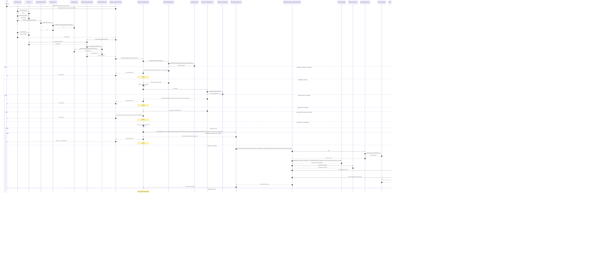

# Diagrama de Secuencia: Eliminación de Caja de Ahorro (cu105)

```mermaid
%%{init: {'version': '11.12.1'}}%%
sequenceDiagram
    autonumber

    actor ST as Estudiante
    participant JA as JwtSessionAspect
    participant JS as JwtService
    participant UE as UserExistsByEmailService
    participant UES as UserExistsService
    participant UR as IUserRepository
    participant SU as SessionUserArgumentResolver
    participant UGB as UserGetByEmailService
    participant C as SavingAccountDeleteController
    participant S as SavingAccountDeleteService
    participant SG as StudentGetByEmailService
    participant SR as IStudentRepository
    participant SF as SavingAccountFindByIdService
    participant SAR as ISavingAccountRepository
    participant TG as TransactionGenerateService
    participant STR as WithdrawalSavingAccountTransactionService
    participant TRM as TransactionMapper
    participant TR as ITransactionRepository
    participant RFL as ReserveFindLastService
    participant RR as IReserveRepository
    participant WAS as WalletAddAmountService
    participant WR as IWalletRepository
    participant RMS as ReserveModifyService
    participant WUB as WalletUpdateInvestedBalanceService
    participant ICT as InvestemtCalculateTotalInvestedService
    participant SCI as StockCalculateAmountInvestedService
    participant STO as IStockRepository
    participant SCBW as StockCalculateByWalletService
    participant ORD as IOrderRepository
    participant FTD as FixedTermDepositCalculateAmountInvestedService
    participant FDR as IFixedTermDepositRepository
    participant SAI as SavingAccountCalculateAmountInvestedService
    participant SM as SuccessfulMessages
    participant RF as ResponseFactory

    ST->>C: DELETE /investment/saving-accounts/{id}
    C->>JA: validateJwt(Authorization, {ROLE_STUDENT})
    JA->>JS: isTokenExpired(jwt)
    JS-->>JA: false
    JA->>JS: extractUsername(jwt)
    JS-->>JA: studentEmail
    JA->>UE: validateIfUserIsActive(studentEmail)
    UE->>UES: validate(studentEmail)
    UES->>UR: existsByEmailAndDeletedAtIsNull(studentEmail)
    UR-->>UES: true
    UES-->>UE: ok
    JA->>JS: extractRole(jwt)
    JS-->>JA: ROLE_STUDENT
    JA-->>C: sesión válida

    C->>SU: resolveArgument(@SessionUser)
    SU->>JS: extractUsername(jwt)
    JS-->>SU: studentEmail
    SU->>UGB: findUserByEmail(studentEmail)
    UGB->>UR: findByEmailAndDeletedAtIsNull(studentEmail)
    UR-->>UGB: Optional<User>
    UGB-->>SU: User sessionUser
    SU-->>C: User sessionUser

    C->>S: cu105deleteSavingAccount(id, sessionUser)
    S->>SG: getByEmail(sessionUser.getEmail())
    SG->>SR: findByUserEmailAndDeletedAtIsNull(sessionUser.getEmail())
    SR-->>SG: Optional<Student>
    alt Estudiante sin wallet o no encontrado
        SG-->>S: NotFoundException("Estudiante con email ... no encontrado")
        S-->>C: Propaga excepción
        C-->>ST: 404 Not Found
        note over S: finCU()
    else Estudiante encontrado
        SG-->>S: Student student (con wallet)
        S->>S: wallet = student.getWallet()
        S->>SF: execute(id)
        SF->>SAR: findByIdAndDeletedAtIsNull(id)
        SAR-->>SF: Optional<SavingAccount>
        alt Caja de ahorro no encontrada
            SF-->>S: NotFoundException("No existe una caja de ahorro con el id proporcionado")
            S-->>C: Propaga excepción
            C-->>ST: 404 Not Found
            note over S: finCU()
        else Caja de ahorro encontrada
            SF-->>S: SavingAccount savingAccount
            alt Caja de ahorro pertenece a otro wallet
                S-->>C: ConflictException("La cuenta de ahorro no pertenece al estudiante")
                C-->>ST: 409 Conflict
                note over S: finCU()
            else Caja de ahorro del estudiante
                S->>S: savingAccount.setDeletedAt(now)
                alt Monto actual > 0
                    S->>TG: generate(RETIRO_CAJA_AHORRO, savingAccount.getCurrentAmount(), "Retiro de caja de ahorro", SISTEMA, ESTUDIANTE, wallet, null, null, null, null, null, savingAccount)
                    alt Estrategia no soportada / monto inválido
                        TG-->>S: ConflictException / BadRequestException
                        S-->>C: Propaga excepción
                        C-->>ST: HTTP error correspondiente
                        note over S: finCU()
                    else Transacción generada
                        TG->>STR: execute(savingAccount.getCurrentAmount(), "Retiro de caja de ahorro", SISTEMA, ESTUDIANTE, wallet, null, null, null, null, null, savingAccount)
                        STR->>RFL: get()
                        RFL->>RR: findFirstByOrderByCreatedAtDesc()
                        RR-->>RFL: Reserve reserve
                        RFL-->>STR: Reserve reserve
                        STR->>TRM: toModel(amount, "Retiro de caja de ahorro", SISTEMA, ESTUDIANTE, wallet, null, null, null, null, null, savingAccount, reserve)
                        TRM-->>STR: Transaction transactionModel
                        STR->>TR: save(transactionModel)
                        TR-->>STR: Transaction transaction
                        STR->>WAS: execute(wallet, amount)
                        WAS->>WR: save(walletActualizada)
                        WR-->>WAS: Wallet walletActualizada
                        STR->>RMS: moveToCirculation(amount, reserve)
                        RMS->>RR: save(reserveActualizada)
                        RR-->>RMS: Reserve reserveActualizada
                        STR-->>TG: Transaction transaction
                        TG-->>S: Transaction transaction
                    end
                else Monto actual == 0
                    note over S: No se generan transacciones
                end

                S->>S: savingAccount.setCurrentAmount(0.0)
                S->>SAR: save(savingAccount)
                SAR-->>S: SavingAccount savingAccountActualizada
                S->>WUB: execute(wallet)
                WUB->>ICT: cu110calculateTotalInvested(wallet)
                ICT->>SCI: execute(wallet)
                SCI->>STO: findAll()
                STO-->>SCI: List<Stock>
                SCI->>SCBW: execute(stock, wallet)
                SCBW->>ORD: findByWalletAndStockAndOrderState(wallet, stock, EJECUTADA)
                ORD-->>SCBW: List<Order>
                SCBW-->>SCI: BigInteger cantidadNeta
                SCI-->>ICT: Double totalAcciones
                ICT->>FTD: execute(wallet)
                FTD->>FDR: findByFixedTermState(IN_PROGRESS)
                FDR-->>FTD: List<FixedTermDeposit>
                FTD-->>ICT: Double totalPlazosFijos
                ICT->>SAI: execute(wallet)
                SAI->>SAR: findAllByWalletAndDeletedAtIsNull(wallet)
                SAR-->>SAI: List<SavingAccount>
                SAI-->>ICT: Double totalCajasAhorro
                ICT-->>WUB: Double totalInvertido
                WUB->>WR: save(wallet con totalInvertido)
                WR-->>WUB: Wallet walletConTotalInvertido

                S-->>C: void
                C->>SM: createdSuccessfully("Caja de ahorro")
                SM-->>C: "Caja de ahorro creado correctamente"
                C->>RF: noContent("Caja de ahorro creado correctamente")
                RF-->>C: ResponseEntity 204
                C-->>ST: 204 No Content
                note over S: finCU()
            end
        end
    end

```

