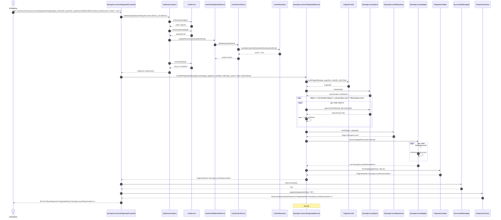

# Diagrama de Secuencia: Listado Paginado de Cajas de Ahorro

```mermaid
%%{init: {'version': '11.12.1'}}%%
sequenceDiagram
    autonumber

    actor ST as Estudiante
    participant C as SavingAccountListPaginatedController
    participant JA as JwtSessionAspect
    participant JS as JwtService
    participant UE as UserExistsByEmailService
    participant UES as UserExistsService
    participant UR as IUserRepository
    participant S as SavingAccountListPaginatedService
    participant PU as PaginatorUtils
    participant SAS as SavingAccountSpecs
    participant SAR as ISavingAccountRepository
    participant SAM as SavingAccountMapper
    participant PH as PaginationHelper
    participant SM as SuccessfulMessages
    participant RF as ResponseFactory

    ST->>C: GET /investment/saving-accounts/paginated?page&page_size&order_by&order_type&search&filters&filtersValues [Authorization: Bearer "<jwt>"]
    C->>JA: validateJwt(@SessionRequired roles={ROLE_STUDENT})
    JA->>JS: isTokenExpired(jwt)
    JS-->>JA: token vigente
    JA->>JS: extractUsername(jwt)
    JS-->>JA: studentEmail
    JA->>UE: validateIfUserIsActive(studentEmail)
    UE->>UES: validate(studentEmail)
    UES->>UR: existsByEmailAndDeletedAtIsNull(studentEmail)
    UR-->>UES: exists = true
    UES-->>UE: usuario activo
    JA->>JS: extractRole(jwt)
    JS-->>JA: ROLE_STUDENT
    JA-->>C: validación satisfactoria

    C->>S: cu106listPaginatedSavingAccounts(page, pageSize, orderBy, orderType, search, filters, filtersValues)
    S->>PU: buildPageable(page, pageSize, orderBy, orderType)
    PU-->>S: Pageable
    S->>SAS: notDeleted()
    SAS-->>S: Specification notDeleted
    opt filters != null && filtersValues != null && filters.size == filtersValues.size
        loop por cada índice i
            S->>SAS: genericFilter(filters[i], filtersValues[i])
            SAS-->>S: Specification filtro
            S->>S: spec = spec.and(filtro)
        end
    end
    S->>SAR: findAll(spec, pageable)
    SAR-->>S: Page<SavingAccount>
    S->>SAM: toDtoList(pageResult.getContent())
    loop por cada SavingAccount
        SAM->>SAM: toDto(savingAccount)
    end
    SAM-->>S: List<SavingAccountResponseDto>
    S->>PH: fromPage(pageResult, dtoList)
    PH-->>S: PaginatedData<SavingAccountResponseDto>
    S-->>C: PaginatedData<SavingAccountResponseDto>

    C->>SM: okSuccessfully()
    SM-->>C: "OK"
    C->>RF: paginated(paginatedData, "OK")
    RF-->>C: ResponseEntity<BaseResponse<PaginatedData<SavingAccountResponseDto>>>
    C-->>ST: 200 OK (BaseResponse<PaginatedData<SavingAccountResponseDto>>)
    note over S: finCU()
```

