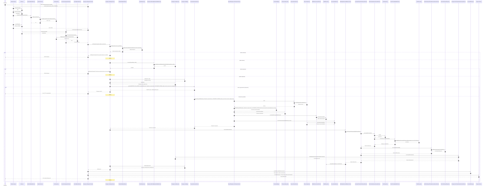

# Diagrama de Secuencia: Registro de Caja de Ahorro

```mermaid
%%{init: {'version': '11.12.1'}}%%
sequenceDiagram
    autonumber

    actor ST as Estudiante
    participant JA as JwtSessionAspect
    participant JS as JwtService
    participant UE as UserExistsByEmailService
    participant UES as UserExistsService
    participant UR as IUserRepository
    participant SU as SessionUserArgumentResolver
    participant UGB as UserGetByEmailService
    participant C as SavingAccountRegisterController
    participant S as SavingAccountRegisterService
    participant SG as StudentGetByEmailService
    participant SR as IStudentRepository
    participant SAE as SavingAccountExistsByNameAndWalletService
    participant SAR as ISavingAccountRepository
    participant SAM as SavingAccountMapper
    participant TG as TransactionGenerateService
    participant STR as DepositSavingAccountTransactionService
    participant TRM as TransactionMapper
    participant TR as ITransactionRepository
    participant RFL as ReserveFindLastService
    participant RR as IReserveRepository
    participant WRM as WalletRemoveAmountService
    participant WR as IWalletRepository
    participant RMS as ReserveModifyService
    participant WUB as WalletUpdateInvestedBalanceService
    participant ICT as InvestmentCalculateTotalInvestedService
    participant SCI as StockCalculateAmountInvestedService
    participant STO as IStockRepository
    participant SCBW as StockCalculateByWalletService
    participant ORD as IOrderRepository
    participant FTD as FixedTermDepositCalculateAmountInvestedService
    participant FDR as IFixedTermDepositRepository
    participant SAI as SavingAccountCalculateAmountInvestedService
    participant SM as SuccessfulMessages
    participant RF as ResponseFactory


    ST->>C: POST /investment/saving-accounts(dto)
    C->>JA: validateJwt(Authorization, {ROLE_STUDENT})
    JA->>JS: isTokenExpired(jwt)
    JS-->>JA: false
    JA->>JS: extractUsername(jwt)
    JS-->>JA: studentEmail
    JA->>UE: validateIfUserIsActive(studentEmail)
    UE->>UES: validate(studentEmail)
    UES->>UR: existsByEmailAndDeletedAtIsNull(studentEmail)
    UR-->>UES: exists = true
    UES-->>UE: ok
    JA->>JS: extractRole(jwt)
    JS-->>JA: ROLE_STUDENT
    JA-->>C: sesión válida

    C->>SU: resolveArgument(@SessionUser)
    SU->>JS: extractUsername(jwt)
    JS-->>SU: studentEmail
    SU->>UGB: findUserByEmail(studentEmail)
    UGB->>UR: findByEmailAndDeletedAtIsNull(studentEmail)
    UR-->>UGB: Optional<User>
    UGB-->>SU: User
    SU-->>C: User sessionUser

    C->>S: cu102registerSavingAccount(dto, sessionUser)
    S->>SG: getByEmail(sessionUser.getEmail())
    SG->>SR: findByUserEmailAndDeletedAtIsNull(sessionUser.getEmail())
    SR-->>SG: Optional<Student>
    SG-->>S: Student student(con wallet)

    alt Saldo insuficiente
        S-->>C: BadRequestException("No hay saldo suficiente en la wallet")
        C-->>ST: 400 Bad Request
        note over S: finCU()
    else Saldo suficiente
        S->>SAE: execute(dto.getName(), wallet)
        SAE->>SAR: existsByNameAndWalletAndDeletedAtIsNull(dto.getName(), wallet)
        SAR-->>SAE: exists?
        SAE-->>S: resultado

        alt Nombre duplicado
            S-->>C: BadRequestException("Ya existe una cuenta de ahorro con ese nombre")
            C-->>ST: 400 Bad Request
            note over S: finCU()
        else Nombre disponible
            S->>SAM: toModel(dto, wallet)
            SAM-->>S: SavingAccount entity
            S->>SAR: save(entity)
            SAR-->>S: SavingAccount savingAccount

            S->>TG: generate(INGRESO_CAJA_AHORRO, dto.getInitialAmount(), "Deposito en caja de ahorro", ESTUDIANTE, SISTEMA, wallet, null, null, null, null, null, savingAccount)

            alt Error en generación de transacción
                TG-->>S: ConflictException / BadRequestException
                S-->>C: Propaga excepción
                C-->>ST: Error HTTP correspondiente
                note over S: finCU()
            else Transacción generada
                TG->>STR: execute(dto.getInitialAmount(), "Deposito en caja de ahorro", ESTUDIANTE, SISTEMA, wallet, null, null, null, null, null, savingAccount)
                STR->>RFL: get()
                RFL->>RR: findFirstByOrderByCreatedAtDesc()
                RR-->>RFL: Reserve reserve
                RFL-->>STR: reserve
                STR->>TRM: toModel(dto.getInitialAmount(), "Deposito en caja de ahorro", ESTUDIANTE, SISTEMA, wallet, null, null, null, null, null, savingAccount, reserve)
                TRM-->>STR: Transaction transactionModel
                STR->>TR: save(transactionModel)
                TR-->>STR: Transaction transaction
                STR->>WRM: execute(wallet, dto.getInitialAmount())
                WRM->>WR: save(walletActualizada)
                WR-->>WRM: Wallet walletActualizada
                STR->>RMS: moveToReserve(dto.getInitialAmount(), reserve)
                RMS->>RR: save(reserveActualizada)
                RR-->>RMS: Reserve reserveActualizada
                STR-->>TG: Transaction transaction
                TG-->>S: Transaction transaction

                S->>WUB: execute(walletActualizada)
                WUB->>ICT: cu110calculateTotalInvested(walletActualizada)
                ICT->>SCI: execute(walletActualizada)
                SCI->>STO: findAll()
                STO-->>SCI: List<Stock>
                SCI->>SCBW: execute(stock, walletActualizada)
                SCBW->>ORD: findByWalletAndStockAndOrderState(walletActualizada, stock, EJECUTADA)
                ORD-->>SCBW: List<Order>
                SCBW-->>SCI: BigInteger cantidadNeta
                SCI-->>ICT: Double totalAcciones
                ICT->>FTD: execute(walletActualizada)
                FTD->>FDR: findByFixedTermState(IN_PROGRESS)
                FDR-->>FTD: List<FixedTermDeposit>
                FTD-->>ICT: Double totalPlazosFijos
                ICT->>SAI: execute(walletActualizada)
                SAI->>SAR: findAllByWalletAndDeletedAtIsNull(walletActualizada)
                SAR-->>SAI: List<SavingAccount>
                SAI-->>ICT: Double totalCajasAhorro
                ICT-->>WUB: Double totalInvertido
                WUB->>WR: save(walletActualizada con totalInvertido)

                S->>SAM: toDto(savingAccount)
                SAM-->>S: SavingAccountResponseDto dtoResponse
                S-->>C: dtoResponse
                C->>SM: createdSuccessfully("Caja de ahorro")
                SM-->>C: "Caja de ahorro creado correctamente"
                C->>RF: created(dtoResponse, "Caja de ahorro creado correctamente")
                RF-->>C: ResponseEntity 201
                C-->>ST: 201 Created (dtoResponse)
                note over S: finCU()
            end
        end
    end
```
