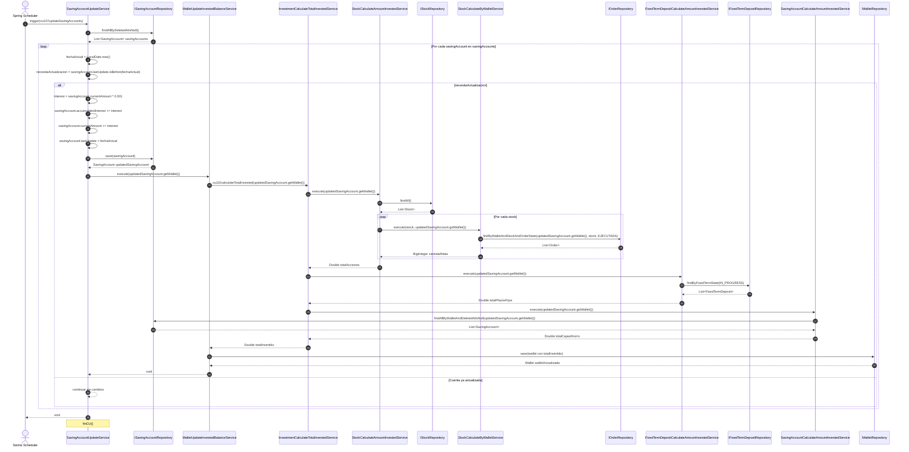

# Diagrama de Secuencia: Actualización diaria de Cajas de Ahorro (cu107)

```mermaid
%%{init: {'version': '11.12.1'}}%%
sequenceDiagram
    autonumber

    actor SS as Spring Scheduler
    participant S as SavingAccountUpdateService
    participant SAR as ISavingAccountRepository
    participant WUB as WalletUpdateInvestedBalanceService
    participant ICT as InvestmentCalculateTotalInvestedService
    participant SCI as StockCalculateAmountInvestedService
    participant STO as IStockRepository
    participant SCBW as StockCalculateByWalletService
    participant ORD as IOrderRepository
    participant FTD as FixedTermDepositCalculateAmountInvestedService
    participant FDR as IFixedTermDepositRepository
    participant SAI as SavingAccountCalculateAmountInvestedService
    participant WR as IWalletRepository

    SS->>S: trigger(cu107updateSavingAccounts)
    S->>SAR: findAllByDeletedAtIsNull()
    SAR-->>S: List<SavingAccount> savingAccounts

    loop Por cada savingAccount en savingAccounts
        S->>S: fechaActual = LocalDate.now()
        S->>S: necesitaActualizacion = savingAccount.lastUpdate.isBefore(fechaActual)

        alt necesitaActualizacion
            S->>S: interest = savingAccount.currentAmount * 0.001
            S->>S: savingAccount.accumulatedInterest += interest
            S->>S: savingAccount.currentAmount += interest
            S->>S: savingAccount.lastUpdate = fechaActual

            S->>SAR: save(savingAccount)
            SAR-->>S: SavingAccount updatedSavingAccount

            S->>WUB: execute(updatedSavingAccount.getWallet())
            WUB->>ICT: cu110calculateTotalInvested(updatedSavingAccount.getWallet())

            ICT->>SCI: execute(updatedSavingAccount.getWallet())
            SCI->>STO: findAll()
            STO-->>SCI: List<Stock>

            loop Por cada stock
                SCI->>SCBW: execute(stock, updatedSavingAccount.getWallet())
                SCBW->>ORD: findByWalletAndStockAndOrderState(updatedSavingAccount.getWallet(), stock, EJECUTADA)
                ORD-->>SCBW: List<Order>
                SCBW-->>SCI: BigInteger cantidadNeta
            end

            SCI-->>ICT: Double totalAcciones

            ICT->>FTD: execute(updatedSavingAccount.getWallet())
            FTD->>FDR: findByFixedTermState(IN_PROGRESS)
            FDR-->>FTD: List<FixedTermDeposit>
            FTD-->>ICT: Double totalPlazosFijos

            ICT->>SAI: execute(updatedSavingAccount.getWallet())
            SAI->>SAR: findAllByWalletAndDeletedAtIsNull(updatedSavingAccount.getWallet())
            SAR-->>SAI: List<SavingAccount>
            SAI-->>ICT: Double totalCajasAhorro

            ICT-->>WUB: Double totalInvertido
            WUB->>WR: save(wallet con totalInvertido)
            WR-->>WUB: Wallet walletActualizada
            WUB-->>S: void
        else Cuenta ya actualizada
            S-->>S: continuar sin cambios
        end
    end

    S-->>SS: void
    note over S: finCU()
```

