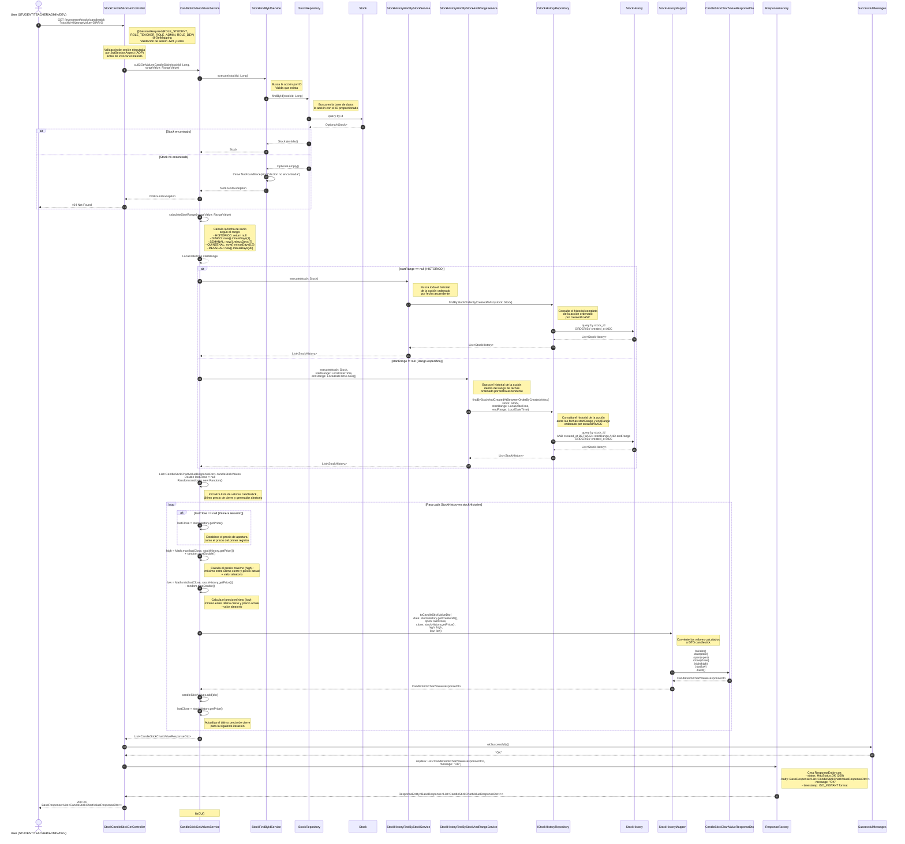

# Diagrama de Secuencia: Obtención de Valores Candlestick de Acción

Este diagrama muestra el flujo completo del endpoint `GET /investment/stocks/candlestick`, desde el controlador `StockCandleStickGetController` hasta todas las capas involucradas en la obtención de los valores candlestick (gráfico de velas) de una acción específica.

## Descripción del Flujo

El caso de uso `cu83GetValuesCandleStick` permite a un usuario con rol `ROLE_STUDENT`, `ROLE_TEACHER`, `ROLE_ADMIN` o `ROLE_DEV` obtener los valores candlestick de una acción para visualizarlos en un gráfico. El flujo incluye:

1. Validación de la sesión y permisos mediante `@SessionRequired`
2. Búsqueda de la acción por ID mediante `StockFindByIdService`
3. Validación de existencia de la acción (lanza `NotFoundException` si no existe)
4. Cálculo del rango de fechas según el `RangeValue` proporcionado (DIARIO, SEMANAL, QUINZENAL, MENSUAL o HISTORICO)
5. Búsqueda del historial de la acción según el rango:
   - Si el rango es `HISTORICO`: busca todo el historial
   - Si el rango es otro: busca el historial dentro del rango de fechas calculado
6. Procesamiento de cada registro histórico para calcular los valores candlestick (open, close, high, low)
7. Conversión de los valores a DTOs mediante `StockHistoryMapper`
8. Retorno de la respuesta HTTP 200 OK con la lista de valores candlestick

## Componentes Involucrados

### Controller
- **StockCandleStickGetController**: Punto de entrada del endpoint REST. Valida la sesión y permisos, recibe los parámetros `stockId` y `rangeValue`, y retorna la respuesta HTTP con la lista de valores candlestick.

### Services
- **CandleStickGetValuesService**: Contiene la lógica de negocio del caso de uso. Orquesta la búsqueda de la acción, el cálculo del rango de fechas, la búsqueda del historial según el rango, el procesamiento de cada registro histórico para calcular los valores candlestick (open, close, high, low), y la conversión a DTOs.
- **StockFindByIdService**: Servicio común que busca una acción por ID. Lanza `NotFoundException` si la acción no existe.
- **StockHistoryFindByStockService**: Servicio común que busca todo el historial de una acción ordenado por fecha de creación ascendente.
- **StockHistoryFindByStockAndRangeService**: Servicio común que busca el historial de una acción dentro de un rango de fechas específico, ordenado por fecha de creación ascendente.

### Mappers
- **StockHistoryMapper**: Responsable de convertir los valores calculados a DTOs `CandleStickChartValueResponseDto`. Incluye el método `toCandleStickValueDto` que recibe los valores date, open, close, high y low.

### Repositories
- **IStockRepository**: Interfaz de persistencia para la entidad `Stock`. Extiende `CrudRepository<Stock, Long>`. Proporciona el método `findById` para buscar acciones por ID.
- **IStockHistoryRepository**: Interfaz de persistencia para la entidad `StockHistory`. Extiende `CrudRepository<StockHistory, Long>`. Proporciona los métodos:
  - `findByStockOrderByCreatedAtAsc`: Busca todo el historial de una acción ordenado por fecha ascendente.
  - `findByStockAndCreatedAtBetweenOrderByCreatedAtAsc`: Busca el historial de una acción dentro de un rango de fechas, ordenado por fecha ascendente.

### Entities
- **Stock**: Entidad que representa una acción en el sistema. Contiene información como nombre, abreviación, precios, cantidades y nivel de riesgo.
- **StockHistory**: Entidad que representa un registro histórico de una acción. Almacena el precio, cantidades disponibles y vendidas, y la variación en un momento específico.

### DTOs
- **CandleStickChartValueResponseDto**: DTO de respuesta que contiene los valores candlestick para un punto en el tiempo. Incluye date (fecha del registro), open (precio de apertura), close (precio de cierre), high (precio máximo) y low (precio mínimo).

### Response Factory
- **ResponseFactory**: Utilidad para crear respuestas HTTP estandarizadas. Proporciona el método `ok` que crea una respuesta HTTP 200 OK con un `BaseResponse` que incluye los datos, mensaje y timestamp.

### Successful Messages
- **SuccessfulMessages**: Utilidad para obtener mensajes de éxito estandarizados. Proporciona el método `okSuccessfully()` que retorna el mensaje "OK".

## Validaciones

- **Nivel de Controller**: Validación de sesión y permisos mediante `@SessionRequired(roles = {Role.ROLE_STUDENT, Role.ROLE_TEACHER, Role.ROLE_ADMIN, Role.ROLE_DEV})`. La validación se ejecuta mediante AOP (`JwtSessionAspect`) antes de invocar el método del controlador. Valida:
  - Presencia del header `Authorization` con formato `Bearer {token}`
  - Expiración del token JWT
  - Validez de la firma del token
  - Actividad del usuario en la base de datos
  - Que el rol del usuario esté en la lista de roles permitidos
- **Nivel de Service**: Validación de existencia de la acción mediante `StockFindByIdService`. Si la acción no existe, se lanza `NotFoundException` con el mensaje "Accion no encontrada".

## Cálculo de Valores Candlestick

Los valores candlestick se calculan de la siguiente manera:

1. **Open (Apertura)**: Para el primer registro, se usa el precio del registro. Para los siguientes, se usa el precio de cierre (`lastClose`) del registro anterior.
2. **Close (Cierre)**: Se usa el precio (`price`) del registro histórico actual.
3. **High (Máximo)**: Se calcula como el máximo entre el último precio de cierre y el precio actual, más un valor aleatorio: `Math.max(lastClose, stockHistory.getPrice()) + random.nextDouble()`
4. **Low (Mínimo)**: Se calcula como el mínimo entre el último precio de cierre y el precio actual, menos un valor aleatorio: `Math.min(lastClose, stockHistory.getPrice()) - random.nextDouble()`

**Nota**: Los valores `high` y `low` incluyen un componente aleatorio para simular variaciones en los precios máximos y mínimos durante el período representado por cada registro histórico.

## Rangos de Fechas

El sistema soporta los siguientes rangos de fechas mediante el enum `RangeValue`:

- **DIARIO**: Últimos 1 día (`now().minusDays(1)`)
- **SEMANAL**: Últimos 7 días (`now().minusDays(7)`)
- **QUINZENAL**: Últimos 15 días (`now().minusDays(15)`)
- **MENSUAL**: Últimos 30 días (`now().minusDays(30)`)
- **HISTORICO**: Todo el historial disponible (sin filtro de fechas)

## Ordenamiento

El historial se retorna ordenado por fecha de creación ascendente (`ORDER BY created_at ASC`), lo que permite visualizar la evolución de la acción desde el punto inicial del rango seleccionado hasta el momento actual.

## Notas Adicionales

- Si la acción no existe, se retorna un error HTTP 404 Not Found con el mensaje "Accion no encontrada".
- Si el historial está vacío, se retorna una lista vacía (no se lanza ninguna excepción).
- Los valores `high` y `low` incluyen un componente aleatorio para simular variaciones en los precios. Este componente se genera mediante `Random.nextDouble()` en cada iteración.
- El precio de apertura (`open`) del primer registro es igual al precio de cierre (`close`) de ese mismo registro (ya que no hay un registro anterior).
- La respuesta incluye un timestamp en el `BaseResponse` que indica el momento en que se generó la respuesta, no el timestamp de los registros históricos.
- El parámetro `stockId` tiene un valor por defecto de `0` si no se proporciona.
- El parámetro `rangeValue` tiene un valor por defecto de `DIARIO` si no se proporciona.

