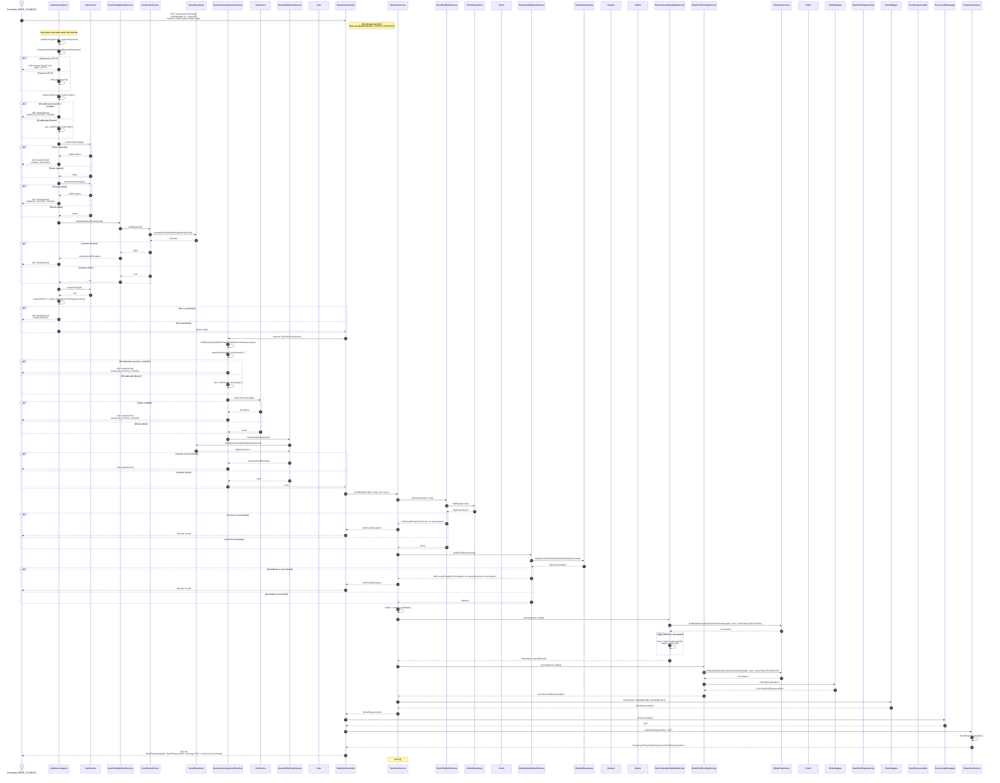

# Diagrama de Secuencia: Obtener Stock por ID (cu100)

```mermaid
%%{init: {'version': '11.12.1'}}%%
sequenceDiagram
    autonumber
    actor ST as Estudiante (ROLE_STUDENT)
    participant JA as JwtSessionAspect
    participant JS as IJwtService
    participant UES as UserExistsByEmailService
    participant UExS as UserExistsService
    participant UR as IUserRepository
    participant SUAR as SessionUserArgumentResolver
    participant JWS as JwtService
    participant UGS as IUserGetByEmailService
    participant User as User
    participant C as StockGetController
    participant Svc as StockGetService
    participant SFind as StockFindByIdService
    participant SR as IStockRepository
    participant Stock as Stock
    participant SGES as StudentGetByEmailService
    participant SRStu as IStudentRepository
    participant Student as Student
    participant Wallet as Wallet
    participant SCBW as StockCalculateByWalletService
    participant OFP as OrderFindPendingService
    participant OR as IOrderRepository
    participant Order as Order
    participant OM as OrderMapper
    participant SellDto as StockSellResponseDto
    participant SM as StockMapper
    participant DTO as StockResponseDto
    participant SMes as SuccessfulMessages
    participant RF as ResponseFactory

    ST->>C: GET /investment/stocks/{id}<br/>PathVariable: id = {stockId}<br/>Header: Authorization: Bearer {jwt}
    Note right of C: @GetMapping("/{id}")<br/>@SessionRequired(roles = {ROLE_STUDENT})

    Note over JA: Interceptor ejecutado antes del método
    JA->>JA: validateJwt(joinPoint, sessionRequired)
    JA->>JA: RequestContextHolder.getRequestAttributes()
    alt Solicitud no HTTP
        JA-->>ST: 500 Internal Server Error<br/>(NOT_HTTP)
    else Petición HTTP
        JA->>JA: attrs.getRequest()
    end
    JA->>JA: request.getHeader("Authorization")
    alt Encabezado ausente o inválido
        JA-->>ST: 401 Unauthorized<br/>(INVALID_ACCESS_TOKEN)
    else Encabezado Bearer
        JA->>JA: jwt = authHeader.substring(7)
    end
    JA->>JS: isTokenExpired(jwt)
    alt Token expirado
        JS-->>JA: JwtException
        JA-->>ST: 401 Unauthorized<br/>(TOKEN_EXPIRED)
    else Token vigente
        JS-->>JA: false
    end
    JA->>JS: extractUsername(jwt)
    alt Firma inválida
        JS-->>JA: JwtException
        JA-->>ST: 401 Unauthorized<br/>(INVALID_ACCESS_TOKEN)
    else Email válido
        JS-->>JA: email
    end
    JA->>UES: validateIfUserIsActive(email)
    UES->>UExS: validate(email)
    UExS->>UR: existsByEmailAndDeletedAtIsNull(email)
    UR-->>UExS: boolean
    alt Usuario inactivo
        UExS-->>UES: false
        UES-->>JA: UnauthorizedException
        JA-->>ST: 401 Unauthorized
    else Usuario activo
        UExS-->>UES: true
        UES-->>JA: ok
    end
    JA->>JS: extractRole(jwt)
    JS-->>JA: role
    JA->>JA: requiredRoles = Arrays.asList(sessionRequired.roles())
    alt Rol no permitido
        JA-->>ST: 401 Unauthorized<br/>(requiredRoles)
    else Rol autorizado
        JA-->>C: Token válido
    end

    C->>SUAR: resolver @SessionUser(User)
    SUAR->>SUAR: webRequest.getNativeRequest(HttpServletRequest.class)
    SUAR->>SUAR: request.getHeader("Authorization")
    alt Encabezado ausente o inválido
        SUAR-->>ST: 401 Unauthorized<br/>(INVALID_ACCESS_TOKEN)
    else Encabezado Bearer
        SUAR->>SUAR: jwt = authHeader.substring(7)
    end
    SUAR->>JWS: extractUsername(jwt)
    alt Token inválido
        JWS-->>SUAR: Exception
        SUAR-->>ST: 401 Unauthorized<br/>(INVALID_ACCESS_TOKEN)
    else Email válido
        JWS-->>SUAR: email
    end
    SUAR->>UGS: findUserByEmail(email)
    UGS->>UR: findByEmailAndDeletedAtIsNull(email)
    UR-->>UGS: Optional<User>
    alt Usuario no encontrado
        UGS-->>SUAR: UnauthorizedException
        SUAR-->>ST: 401 Unauthorized
    else Usuario activo
        UGS-->>SUAR: User
        SUAR-->>C: User
    end

    C->>Svc: cu100GetStock(id: Long, user: User)
    Svc->>SFind: execute(stockId: Long)
    SFind->>SR: findById(stockId)
    SR-->>SFind: Optional<Stock>
    alt Acción no encontrada
        SFind-->>Svc: NotFoundException("Accion no encontrada")
        Svc-->>C: NotFoundException
        C-->>ST: 404 Not Found
    else Acción encontrada
        SFind-->>Svc: Stock
    end
    Svc->>SGES: getByEmail(user.email)
    SGES->>SRStu: findByUserEmailAndDeletedAtIsNull(user.email)
    SRStu-->>SGES: Optional<Student>
    alt Estudiante no encontrado
        SGES-->>Svc: NotFoundException("Estudiante con email {email} no encontrado")
        Svc-->>C: NotFoundException
        C-->>ST: 404 Not Found
    else Estudiante encontrado
        SGES-->>Svc: Student
    end
    Svc->>Svc: wallet = student.getWallet()

    Svc->>SCBW: execute(stock, wallet)
    SCBW->>OR: findByWalletAndStockAndOrderState(wallet, stock, OrderState.EJECUTADA)
    OR-->>SCBW: List<Order>
    loop Órdenes ejecutadas
        SCBW->>SCBW: total = total ± order.quantity<br/>(según orderType)
    end
    SCBW-->>Svc: BigInteger quantityBought

    Svc->>OFP: execute(stock, wallet)
    OFP->>OR: findByWalletAndStockAndOrderState(wallet, stock, OrderState.PENDIENTE)
    OR-->>OFP: List<Order>
    OFP->>OM: toSellDtoList(orders)
    OM-->>OFP: List<StockSellResponseDto>
    OFP-->>Svc: List<StockSellResponseDto>

    Svc->>SM: toDto(stock, quantityBought, pendingOrders)
    SM-->>Svc: StockResponseDto
    Svc-->>C: StockResponseDto

    C->>SMes: okSuccessfully()
    SMes-->>C: "OK"
    C->>RF: ok(StockResponseDto, "OK")
    RF->>RF: BaseResponse.builder()...
    RF-->>C: ResponseEntity<BaseResponse<StockResponseDto>>
    C-->>ST: 200 OK<br/>BaseResponse{data: StockResponseDto, message:"OK", errors:null, timestamp}

    note over Svc: finCU()
```

