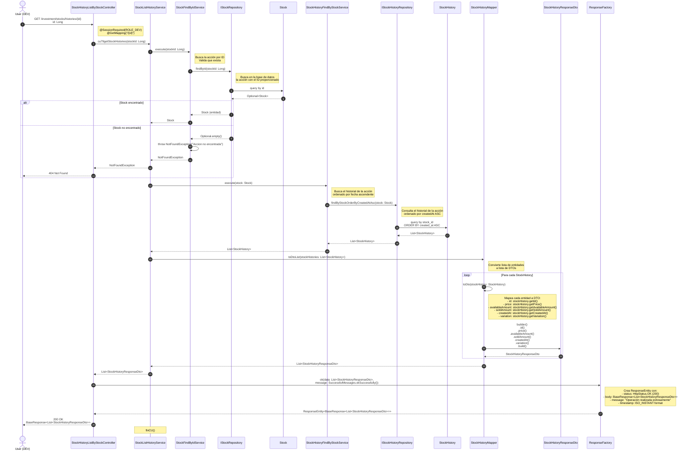

# Diagrama de Secuencia: Listado de Historial de Acción por Stock

Este diagrama muestra el flujo completo del endpoint `GET /investment/stocks/histories/{id}`, desde el controlador `StockHistoryListByStockController` hasta todas las capas involucradas en la obtención del historial de una acción específica.

## Descripción del Flujo

El caso de uso `cu79getStockHistories` permite a un usuario con rol `ROLE_DEV` obtener el historial completo de una acción ordenado por fecha de creación ascendente. El flujo incluye:

1. Validación de la sesión y permisos mediante `@SessionRequired`
2. Búsqueda de la acción por ID mediante `StockFindByIdService`
3. Validación de existencia de la acción (lanza `NotFoundException` si no existe)
4. Búsqueda del historial de la acción mediante `StockHistoryFindByStockService`
5. Conversión de las entidades `StockHistory` a DTOs mediante `StockHistoryMapper`
6. Retorno de la respuesta HTTP 200 OK con la lista de historiales

## Componentes Involucrados

### Controller
- **StockHistoryListByStockController**: Punto de entrada del endpoint REST. Valida la sesión y permisos, recibe el ID de la acción y retorna la respuesta HTTP con la lista de historiales.

### Services
- **StockListHistoryService**: Contiene la lógica de negocio del caso de uso. Orquesta la búsqueda de la acción y su historial, y la conversión a DTOs.
- **StockFindByIdService**: Servicio común que busca una acción por ID. Lanza `NotFoundException` si la acción no existe.
- **StockHistoryFindByStockService**: Servicio común que busca el historial de una acción ordenado por fecha de creación ascendente.

### Mappers
- **StockHistoryMapper**: Responsable de convertir entre entidades `StockHistory` y DTOs `StockHistoryResponseDto`. Incluye métodos para convertir entidades individuales y listas.

### Repositories
- **IStockRepository**: Interfaz de persistencia para la entidad `Stock`. Extiende `CrudRepository<Stock, Long>`. Proporciona el método `findById` para buscar acciones por ID.
- **IStockHistoryRepository**: Interfaz de persistencia para la entidad `StockHistory`. Extiende `CrudRepository<StockHistory, Long>`. Proporciona el método `findByStockOrderByCreatedAtAsc` para buscar el historial de una acción.

### Entities
- **Stock**: Entidad que representa una acción en el sistema. Contiene información como nombre, abreviación, precios, cantidades y nivel de riesgo.
- **StockHistory**: Entidad que representa un registro histórico de una acción. Almacena el precio, cantidades disponibles y vendidas, y la variación en un momento específico.

### DTOs
- **StockHistoryResponseDto**: DTO de respuesta que contiene la información de un registro histórico de una acción. Incluye id, price, availableAmount, soldAmount, createdAt, variation y timestamp.

### Response Factory
- **ResponseFactory**: Utilidad para crear respuestas HTTP estandarizadas. Proporciona el método `ok` que crea una respuesta HTTP 200 OK con un `BaseResponse` que incluye los datos, mensaje y timestamp.

## Validaciones

- **Nivel de Controller**: Validación de sesión y permisos mediante `@SessionRequired(roles = {Role.ROLE_DEV})`. Solo usuarios con rol `ROLE_DEV` pueden acceder a este endpoint.
- **Nivel de Service**: Validación de existencia de la acción mediante `StockFindByIdService`. Si la acción no existe, se lanza `NotFoundException` con el mensaje "Accion no encontrada".

## Ordenamiento

El historial se retorna ordenado por fecha de creación ascendente (`ORDER BY created_at ASC`), lo que permite ver la evolución de la acción desde su registro inicial hasta el momento actual.

## Notas Adicionales

- Si la acción no existe, se retorna un error HTTP 404 Not Found con el mensaje "Accion no encontrada".
- El historial puede estar vacío si la acción no tiene registros históricos (aunque esto no debería ocurrir en condiciones normales, ya que se crea un registro inicial al registrar la acción).
- El campo `timestamp` en el DTO `StockHistoryResponseDto` no se mapea desde la entidad (aunque está presente en el DTO). Solo se mapean los campos: id, price, availableAmount, soldAmount, createdAt y variation.
- La respuesta incluye un timestamp en el `BaseResponse` que indica el momento en que se generó la respuesta, no el timestamp de los registros históricos.

