# Diagrama de Secuencia: Listado Paginado de Acciones

Este diagrama muestra el flujo completo del endpoint `GET /investment/stocks/paginated`, desde el controlador `StockListPaginatedController` hasta todas las capas involucradas en la obtención de la lista paginada de acciones.

## Descripción del Flujo

El caso de uso `cu87ListPaginatedStock` permite a usuarios con roles `ROLE_DEV`, `ROLE_ADMIN`, `ROLE_STUDENT` o `ROLE_TEACHER` obtener una lista paginada de acciones disponibles en el sistema. El flujo incluye:

1. Validación de la sesión y permisos mediante `@SessionRequired` y el interceptor `JwtSessionAspect`
2. Validación del JWT token (expiración, firma, usuario activo)
3. Validación del rol del usuario contra los roles permitidos
4. Construcción del objeto `Pageable` mediante `PaginatorUtils.buildPageable`
5. Construcción de las especificaciones de búsqueda (`Specification<Stock>`) mediante `StockSpecs`
6. Obtención de las acciones paginadas mediante `IStockRepository.findAll(spec, pageable)`
7. Conversión de las entidades `Stock` a DTOs mediante `StockMapper.toDtoList`
8. Construcción del objeto `PaginatedData` mediante `PaginationHelper.fromPage`
9. Retorno de la respuesta HTTP 200 OK con los datos paginados

```mermaid
%%{init: {'version': '11.12.1'}}%%
sequenceDiagram
    autonumber
    actor U as User (DEV/ADMIN/STUDENT/TEACHER)
    participant JA as JwtSessionAspect
    participant C as StockListPaginatedController
    participant Svc as StockListPaginatedService
    participant PU as PaginatorUtils
    participant SS as StockSpecs
    participant SR as IStockRepository
    participant DB as Database
    participant Stock as Stock
    participant SM as StockMapper
    participant DTO as StockResponseDto
    participant PH as PaginationHelper
    participant Resp as ResponseFactory
    participant JS as IJwtService
    participant UES as UserExistsByEmailService
    participant UExS as UserExistService
    participant UR as IUserRepository
    participant User as User

    U->>C: GET /investment/stocks/paginated<br/>?page=1&page_size=10<br/>&order_by=id&order_type=asc<br/>&search=tech&filters=riskLevel<br/>&filtersValues=HIGH<br/>Header: Authorization: Bearer {jwt}
    Note right of C: @SessionRequired(roles = {<br/>ROLE_DEV, ROLE_ADMIN,<br/>ROLE_STUDENT, ROLE_TEACHER})<br/>@GetMapping("/paginated")
    
    Note over JA: Interceptor ejecutado antes del método
    JA->>JA: validateJwt(joinPoint, sessionRequired)
    Note right of JA: Obtiene la solicitud HTTP actual
    JA->>JA: RequestContextHolder.getRequestAttributes()
    JA->>JA: request.getHeader("Authorization")
    
    alt Authorization header no existe o no es Bearer
        JA-->>U: 401 Unauthorized<br/>(INVALID_ACCESS_TOKEN)
    end
    
    JA->>JA: jwt = authHeader.substring(7)
    Note right of JA: Extrae el JWT del header
    
    JA->>JS: isTokenExpired(jwt: String)
    Note right of JS: Valida que el token<br/>no haya expirado
    JS->>JS: extractExpiration(jwt)
    JS->>JS: Verifica si expiration < now
    alt Token expirado
        JS-->>JA: JwtException
        JA-->>U: 401 Unauthorized<br/>(TOKEN_EXPIRED)
    else Token válido
        JS-->>JA: boolean (false = no expirado)
    end
    
    JA->>JS: extractUsername(jwt: String)
    Note right of JS: Extrae el username<br/>del token y valida la firma
    JS->>JS: extractAllClaims(jwt)<br/>parseClaimsJws(token)
    JS->>JS: extractClaim(token, Claims::getSubject)
    alt Firma inválida
        JS-->>JA: JwtException
        JA-->>U: 401 Unauthorized<br/>(INVALID_ACCESS_TOKEN)
    else Firma válida
        JS-->>JA: String (email/username)
    end
    
    JA->>UES: validateIfUserIsActive(email: String)
    Note right of UES: Valida que el usuario<br/>exista y esté activo
    UES->>UExS: validate(email: String)
    UExS->>UR: existsByEmailAndDeletedAtIsNull(email: String)
    Note right of UR: Busca en la base de datos<br/>si el usuario existe<br/>y no está eliminado
    UR->>User: query by email AND deleted_at IS NULL
    User-->>UR: boolean
    UR-->>UExS: boolean
    alt Usuario no existe o está eliminado
        UExS-->>UES: boolean (false)
        UES-->>JA: UnauthorizedException<br/>(UNAUTHORIZED)
        JA-->>U: 401 Unauthorized
    else Usuario existe y está activo
        UExS-->>UES: boolean (true)
        UES-->>JA: void (validación exitosa)
    end
    
    JA->>JS: extractRole(jwt: String)
    Note right of JS: Extrae el rol del token
    JS->>JS: extractAllClaims(jwt)<br/>get("role", String.class)
    JS-->>JA: String (role)
    
    JA->>JA: Arrays.asList(sessionRequired.roles())
    JA->>JA: requiredRoles.contains(jwtRole)
    Note right of JA: Valida que el rol del token<br/>esté en los roles permitidos
    alt Rol no permitido
        JA-->>U: 401 Unauthorized<br/>(requiredRoles message)
    else Rol permitido
        JA-->>C: void (validación exitosa)
    end
    
    Note over C: Validación exitosa, ejecuta método
    C->>C: listPaginated(page, pageSize, orderBy, orderType, search, filters, filtersValues)
    Note right of C: Parámetros recibidos:<br/>- page: int (default: 1)<br/>- pageSize: int (default: 10)<br/>- orderBy: String (default: "id")<br/>- orderType: String (default: "asc")<br/>- search: String (opcional)<br/>- filters: List<String> (opcional)<br/>- filtersValues: List<String> (opcional)
    
    C->>Svc: cu87ListPaginatedStock(page, size, orderBy, orderType, search, filters, filterValues)
    Note right of Svc: Método del caso de uso<br/>cu87ListPaginatedStock
    
    Svc->>PU: buildPageable(page: int, pageSize: int, orderBy: String, orderType: String)
    Note right of PU: Construye el objeto Pageable<br/>para la paginación y ordenamiento
    PU->>PU: direction = "desc".equalsIgnoreCase(orderType) ? DESC : ASC
    PU->>PU: sort = Sort.by(direction, orderBy)
    PU->>PU: PageRequest.of(Math.max(page - 1, 0), pageSize, sort)
    Note right of PU: Convierte página base 1<br/>a página base 0 (Spring Data)
    PU-->>Svc: Pageable
    
    Svc->>Svc: spec = Specification.where(null)
    Note right of Svc: Inicializa la especificación<br/>sin filtros
    
    alt search != null && !search.isBlank()
        Svc->>SS: nameContains(search: String)
        Note right of SS: Crea especificación para<br/>búsqueda por nombre (LIKE)
        SS->>SS: cb.like(cb.lower(root.get("name")), "%" + search.toLowerCase() + "%")
        SS-->>Svc: Specification<Stock>
        Svc->>Svc: spec = spec.and(StockSpecs.nameContains(search))
        Note right of Svc: Combina especificaciones<br/>con operador AND
    end
    
    alt filters != null && filterValues != null && filters.size() == filterValues.size()
        loop Para cada filtro en filters
            Svc->>SS: genericFilter(filters.get(i): String, filterValues.get(i): String)
            Note right of SS: Crea especificación para<br/>filtro genérico por campo
            SS->>SS: cb.equal(root.get(campo), valor)
            Note right of SS: Filtro dinámico por campo<br/>(puede fallar si el campo no existe)
            alt Campo inválido
                SS->>SS: cb.conjunction()
                Note right of SS: Retorna especificación<br/>sin filtro (ignora filtro inválido)
            else Campo válido
                SS-->>Svc: Specification<Stock>
            end
            Svc->>Svc: spec = spec.and(StockSpecs.genericFilter(filters.get(i), filterValues.get(i)))
        end
    end
    
    Svc->>SR: findAll(spec: Specification<Stock>, pageable: Pageable)
    Note right of SR: Busca acciones con<br/>especificaciones y paginación<br/>(JpaSpecificationExecutor)
    SR->>DB: SELECT * FROM stock WHERE ... ORDER BY ... LIMIT ... OFFSET ...
    Note right of DB: Ejecuta query con:<br/>- Filtros de búsqueda (LIKE name)<br/>- Filtros genéricos (campo = valor)<br/>- Ordenamiento (ORDER BY)<br/>- Paginación (LIMIT/OFFSET)
    DB->>Stock: query results
    Stock-->>DB: List<Stock> entities
    DB-->>SR: Page<Stock> (con metadata de paginación)
    Note right of SR: Page incluye:<br/>- Lista de elementos<br/>- Total de elementos<br/>- Total de páginas<br/>- Página actual<br/>- Tamaño de página
    SR-->>Svc: Page<Stock> pageResult
    
    Svc->>Svc: pageResult.getContent()
    Note right of Svc: Obtiene la lista de<br/>entidades Stock de la página
    Svc-->>Svc: List<Stock> stocks
    
    Svc->>SM: toDtoList(stocks: List<Stock>)
    Note right of SM: Convierte entidades Stock<br/>a DTOs StockResponseDto
    loop Para cada Stock en stocks
        SM->>SM: toDto(stock, null, null)
        Note right of SM: Convierte una entidad Stock<br/>a StockResponseDto<br/>(sin quantityBought ni pendingOrders)
        SM->>DTO: builder()<br/>.id(stock.getId())<br/>.name(stock.getName())<br/>.abbreviation(stock.getAbbreviation())<br/>.totalAmount(stock.getTotalAmount())<br/>.availableAmount(stock.getAvailableAmount())<br/>.soldAmount(stock.getSoldAmount())<br/>.currentPrice(stock.getCurrentPrice())<br/>.initialPrice(stock.getInitialPrice())<br/>.riskLevel(stock.getRiskLevel())<br/>.quantityBought(BigInteger.ZERO)<br/>.pendingOrders(null)<br/>.build()
        DTO-->>SM: StockResponseDto
    end
    SM-->>Svc: List<StockResponseDto> dtos
    
    Svc->>PH: fromPage(pageResult: Page<Stock>, dtos: List<StockResponseDto>)
    Note right of PH: Construye el objeto<br/>PaginatedData con metadata
    PH->>PH: PaginatedData.builder()<br/>.results(dtoList)<br/>.count((int) page.getTotalElements())<br/>.totalPages(page.getTotalPages())<br/>.currentPage(page.getNumber() + 1)<br/>.pageSize(page.getSize())<br/>.build()
    Note right of PH: Convierte página base 0<br/>a página base 1 para el cliente
    PH-->>Svc: PaginatedData<StockResponseDto>
    
    Svc-->>C: PaginatedData<StockResponseDto>
    
    C->>Resp: paginated(data: PaginatedData<StockResponseDto>, message: String)
    Note right of Resp: Construye la respuesta HTTP<br/>con formato BaseResponse
    Resp->>Resp: BaseResponse.builder()<br/>.data(data)<br/>.message(message)<br/>.errors(null)<br/>.timestamp(getCurrentTimestamp())<br/>.build()
    Resp->>Resp: ResponseEntity.ok(BaseResponse)
    Resp-->>C: ResponseEntity<BaseResponse<PaginatedData<StockResponseDto>>>
    
    C-->>U: 200 OK<br/>BaseResponse {<br/>  data: PaginatedData {<br/>    results: [StockResponseDto, ...],<br/>    count: int,<br/>    totalPages: int,<br/>    currentPage: int,<br/>    pageSize: int<br/>  },<br/>  message: "Ok successfully",<br/>  errors: null,<br/>  timestamp: "2024-..."<br/>}
    
    note over U,User: finCU()

```

## Parámetros de Entrada

- **page** (int, default: 1): Número de página a consultar (base 1)
- **page_size** (int, default: 10): Tamaño de la página (número de elementos por página)
- **order_by** (String, default: "id"): Campo por el cual ordenar los resultados
- **order_type** (String, default: "asc"): Tipo de ordenación ("asc" o "desc")
- **search** (String, opcional): Texto para buscar en el campo `name` de las acciones (búsqueda LIKE)
- **filters** (List<String>, opcional): Lista de campos por los cuales filtrar
- **filtersValues** (List<String>, opcional): Lista de valores correspondientes a los filtros

## Respuesta

La respuesta es un objeto `BaseResponse` que contiene:

- **data**: Objeto `PaginatedData<StockResponseDto>` con:
  - **results**: Lista de acciones (`List<StockResponseDto>`)
  - **count**: Total de elementos que cumplen los filtros
  - **totalPages**: Total de páginas disponibles
  - **currentPage**: Página actual (base 1)
  - **pageSize**: Tamaño de la página
- **message**: Mensaje de éxito ("Ok successfully")
- **errors**: null
- **timestamp**: Timestamp de la respuesta en formato ISO 8601

## Notas Importantes

1. **Paginación**: Spring Data JPA utiliza páginas base 0, pero el API expone páginas base 1. La conversión se realiza en `PaginatorUtils.buildPageable` (entrada) y `PaginationHelper.fromPage` (salida).

2. **Filtros**: Los filtros genéricos (`StockSpecs.genericFilter`) permiten filtrar por cualquier campo de la entidad `Stock`. Si un campo no existe, el filtro se ignora silenciosamente (retorna `cb.conjunction()`).

3. **Búsqueda**: La búsqueda por texto (`search`) se realiza en el campo `name` usando `LIKE` con case-insensitive.

4. **Especificaciones**: Las especificaciones de JPA se combinan con el operador `AND`, permitiendo múltiples filtros simultáneos.

5. **Autenticación**: El endpoint requiere un token JWT válido en el header `Authorization: Bearer {jwt}` y el usuario debe tener uno de los roles permitidos.

## Participantes del Diagrama

- **User**: Usuario externo (DEV, ADMIN, STUDENT o TEACHER)
- **JwtSessionAspect**: Interceptor que valida la sesión y permisos
- **StockListPaginatedController**: Controlador que maneja la petición HTTP
- **StockListPaginatedService**: Servicio que implementa la lógica de negocio
- **PaginatorUtils**: Utilidad para construir objetos `Pageable`
- **StockSpecs**: Clase de especificaciones JPA para filtros dinámicos
- **IStockRepository**: Repositorio que accede a la base de datos
- **Database**: Base de datos
- **Stock**: Entidad de dominio
- **StockMapper**: Mapper que convierte entidades a DTOs
- **StockResponseDto**: DTO de respuesta
- **PaginationHelper**: Utilidad para construir objetos `PaginatedData`
- **ResponseFactory**: Factory para construir respuestas HTTP
- **IJwtService**: Servicio para manipular tokens JWT
- **UserExistsByEmailService**: Servicio que valida si un usuario existe y está activo
- **UserExistService**: Servicio que verifica la existencia de un usuario
- **IUserRepository**: Repositorio de usuarios
- **User**: Entidad de usuario

