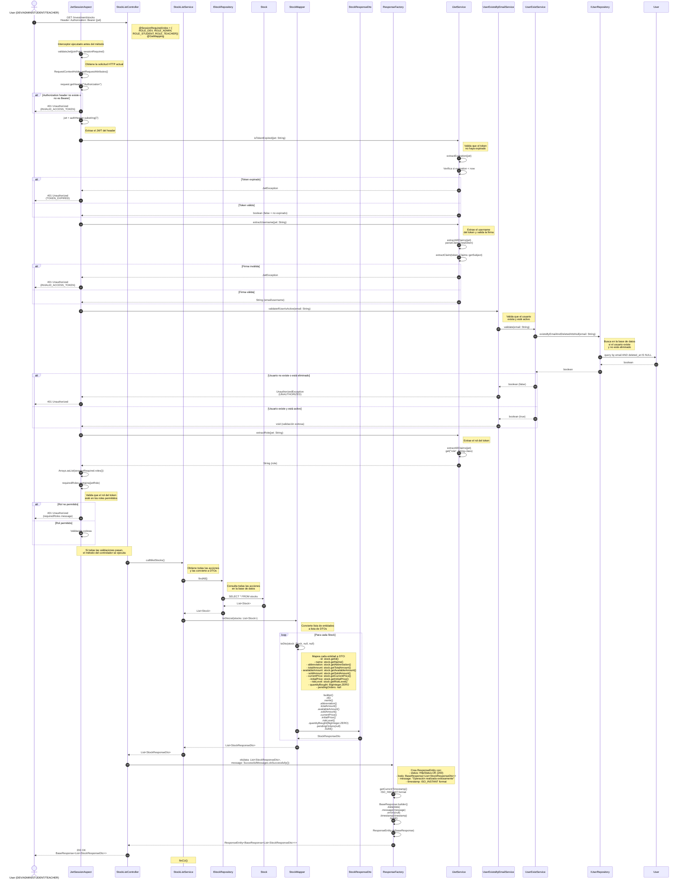

# Diagrama de Secuencia: Listado de Acciones

Este diagrama muestra el flujo completo del endpoint `GET /investment/stocks`, desde el controlador `StockListController` hasta todas las capas involucradas en la obtención de la lista de acciones.

## Descripción del Flujo

El caso de uso `cu86listStocks` permite a usuarios con roles `ROLE_DEV`, `ROLE_ADMIN`, `ROLE_STUDENT` o `ROLE_TEACHER` obtener la lista completa de acciones disponibles en el sistema. El flujo incluye:

1. Validación de la sesión y permisos mediante `@SessionRequired` y el interceptor `JwtSessionAspect`
2. Validación del JWT token (expiración, firma, usuario activo)
3. Validación del rol del usuario contra los roles permitidos
4. Obtención de todas las acciones mediante `IStockRepository.findAll()`
5. Conversión de las entidades `Stock` a DTOs mediante `StockMapper`
6. Retorno de la respuesta HTTP 200 OK con la lista de acciones

## Componentes Involucrados

### Controller
- **StockListController**: Punto de entrada del endpoint REST. Valida la sesión y permisos mediante `@SessionRequired`, recibe la petición GET y retorna la respuesta HTTP con la lista de acciones.

### Interceptor
- **JwtSessionAspect**: Interceptor de Spring AOP que se ejecuta antes de los métodos anotados con `@SessionRequired`. Valida el JWT token, la expiración, la firma, el usuario activo y los roles permitidos.

### Services
- **StockListService**: Contiene la lógica de negocio del caso de uso. Obtiene todas las acciones del repositorio y las convierte a DTOs mediante el mapper.
- **UserExistsByEmailService**: Servicio que valida si un usuario existe y está activo en el sistema. Lanza `UnauthorizedException` si el usuario no existe o está eliminado.
- **UserExistService**: Servicio común que valida la existencia de un usuario mediante su email. Retorna `true` si el usuario existe y no está eliminado.

### Mappers
- **StockMapper**: Responsable de convertir entre entidades `Stock` y DTOs `StockResponseDto`. Incluye métodos para convertir entidades individuales y listas. En este caso, usa `toDtoList` que mapea cada `Stock` a `StockResponseDto` con `quantityBought = BigInteger.ZERO` y `pendingOrders = null`.

### Repositories
- **IStockRepository**: Interfaz de persistencia para la entidad `Stock`. Extiende `CrudRepository<Stock, Long>`. Proporciona el método `findAll()` para obtener todas las acciones.
- **IUserRepository**: Interfaz de persistencia para la entidad `User`. Proporciona el método `existsByEmailAndDeletedAtIsNull` para validar si un usuario existe y está activo.

### JWT Service
- **IJwtService**: Servicio que maneja la generación, validación y extracción de información de tokens JWT. Proporciona métodos para:
  - `isTokenExpired`: Valida si un token ha expirado
  - `extractUsername`: Extrae el username del token y valida la firma
  - `extractRole`: Extrae el rol del token

### Entities
- **Stock**: Entidad que representa una acción en el sistema. Contiene información como nombre, abreviación, precios (inicial y actual), cantidades (total, disponible, vendida) y nivel de riesgo.
- **User**: Entidad que representa un usuario en el sistema. Contiene información como email, rol, y fecha de eliminación (soft delete).

### DTOs
- **StockResponseDto**: DTO de respuesta que contiene la información de una acción. Incluye id, name, abbreviation, totalAmount, availableAmount, soldAmount, currentPrice, initialPrice, riskLevel, quantityBought y pendingOrders.

### Response Factory
- **ResponseFactory**: Utilidad para crear respuestas HTTP estandarizadas. Proporciona el método `ok` que crea una respuesta HTTP 200 OK con un `BaseResponse` que incluye los datos, mensaje y timestamp.

### Messages
- **SuccessfulMessages**: Clase utilitaria que proporciona mensajes de éxito estandarizados. El método `okSuccessfully()` retorna el mensaje "Operación realizada exitosamente".

## Validaciones

- **Nivel de Interceptor (JwtSessionAspect)**: 
  - Validación de existencia del header `Authorization` y formato `Bearer {token}`
  - Validación de expiración del token JWT
  - Validación de la firma del token JWT
  - Validación de existencia y estado activo del usuario
  - Validación del rol del usuario contra los roles permitidos (`ROLE_DEV`, `ROLE_ADMIN`, `ROLE_STUDENT`, `ROLE_TEACHER`)

- **Nivel de Repository**: 
  - La consulta `findAll()` obtiene todas las acciones sin filtros. Si no hay acciones, retorna una lista vacía.

## Manejo de Errores

- **401 Unauthorized**: Se retorna si:
  - El header `Authorization` no existe o no tiene el formato correcto (`INVALID_ACCESS_TOKEN`)
  - El token JWT ha expirado (`TOKEN_EXPIRED`)
  - La firma del token JWT es inválida (`INVALID_ACCESS_TOKEN`)
  - El usuario no existe o está eliminado (`UNAUTHORIZED`)
  - El rol del usuario no está en los roles permitidos (mensaje con los roles requeridos)

- **500 Internal Server Error**: Se retorna si la solicitud no es HTTP (`NOT_HTTP`), aunque esto es muy poco probable en un entorno normal.

## Notas Adicionales

- El endpoint no requiere parámetros. Retorna todas las acciones disponibles en el sistema.
- La lista puede estar vacía si no hay acciones registradas en el sistema.
- Los campos `quantityBought` y `pendingOrders` en el `StockResponseDto` siempre son `BigInteger.ZERO` y `null` respectivamente, ya que este endpoint no incluye información específica del usuario que realiza la petición.
- El interceptor `JwtSessionAspect` se ejecuta automáticamente antes del método del controlador gracias a la anotación `@Before("@annotation(sessionRequired)")` de Spring AOP.
- La validación del token JWT incluye la validación de la firma mediante `parseClaimsJws`, que lanza una excepción si la firma no es válida.
- El timestamp en el `BaseResponse` se genera en formato ISO_INSTANT (UTC) al momento de crear la respuesta.

