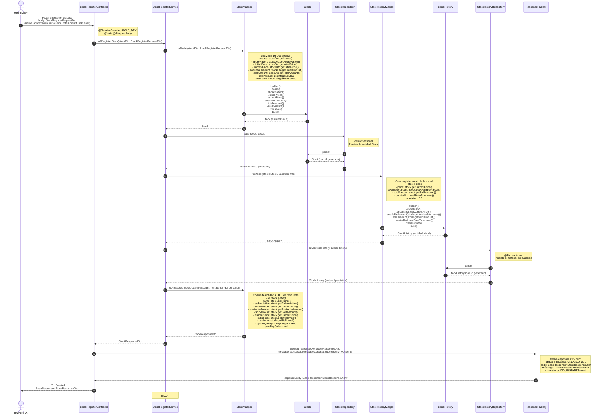

# Diagrama de Secuencia: Registro de Acción (Stock)

Este diagrama muestra el flujo completo del endpoint `POST /investment/stocks`, desde el controlador `StockRegisterController` hasta todas las capas involucradas en el registro de una nueva acción en el sistema.

## Descripción del Flujo

El caso de uso `cu77registerStock` permite a un usuario con rol `ROLE_DEV` registrar una nueva acción en el sistema. El flujo incluye:

1. Validación de la sesión y permisos mediante `@SessionRequired`
2. Conversión del DTO de entrada a entidad mediante `StockMapper`
3. Persistencia de la entidad `Stock` en la base de datos
4. Creación de un registro inicial en el historial de la acción mediante `StockHistoryMapper`
5. Persistencia del historial en la base de datos
6. Conversión de la entidad persistida a DTO de respuesta
7. Retorno de la respuesta HTTP 201 Created al cliente

## Componentes Involucrados

### Controller
- **StockRegisterController**: Punto de entrada del endpoint REST. Valida la sesión y permisos, recibe el DTO de entrada y retorna la respuesta HTTP.

### Service
- **StockRegisterService**: Contiene la lógica de negocio del caso de uso. Orquesta la creación de la acción y su historial inicial, manejando la transacción.

### Mappers
- **StockMapper**: Responsable de convertir entre DTOs y entidades de Stock.
- **StockHistoryMapper**: Responsable de convertir entre DTOs y entidades de StockHistory.

### Repositories
- **IStockRepository**: Interfaz de persistencia para la entidad Stock. Extiende `CrudRepository<Stock, Long>`.
- **IStockHistoryRepository**: Interfaz de persistencia para la entidad StockHistory. Extiende `CrudRepository<StockHistory, Long>`.

### Entities
- **Stock**: Entidad que representa una acción en el sistema. Contiene información como nombre, abreviación, precios, cantidades y nivel de riesgo.
- **StockHistory**: Entidad que representa un registro histórico de una acción. Almacena el precio, cantidades disponibles y vendidas, y la variación en un momento específico.

### DTOs
- **StockRegisterRequestDto**: DTO de entrada que contiene los datos necesarios para registrar una nueva acción.
- **StockResponseDto**: DTO de respuesta que contiene la información de la acción registrada.

## Transaccionalidad

El método `cu77registerStock` está marcado con `@Transactional`, lo que garantiza que:
- La creación de la entidad `Stock` y su historial inicial (`StockHistory`) se ejecuten en una única transacción.
- Si ocurre un error en cualquier punto del proceso, se revierte toda la operación.

## Validaciones

- **Nivel de Controller**: Validación mediante `@Valid` del DTO de entrada, verificando anotaciones como `@NotBlank`, `@NotNull`, `@Positive`, `@Size`.
- **Nivel de Service**: Validaciones de negocio (si aplican) y garantía de integridad transaccional.

## Notas Adicionales

- El precio inicial y el precio actual se establecen con el mismo valor al momento del registro.
- La cantidad disponible se establece igual a la cantidad total al momento del registro.
- La cantidad vendida se inicializa en cero.
- El historial inicial se crea con una variación de 0.0, ya que es el primer registro.

