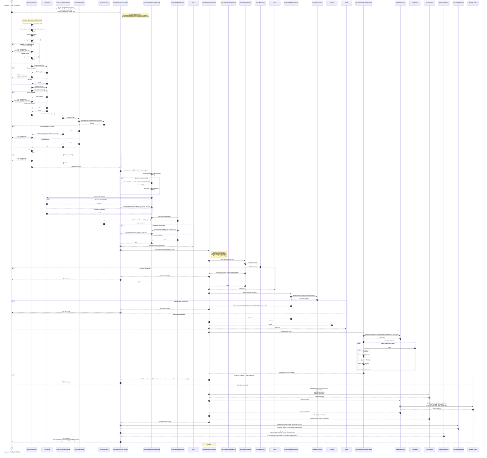

# Diagrama de Secuencia: Registro de Orden Stop de Acción

```mermaid
%%{init: {'version': '11.12.1'}}%%
sequenceDiagram
    autonumber
    actor U as Estudiante (ROLE_STUDENT)
    participant JA as JwtSessionAspect
    participant JS as IJwtService
    participant UES as UserExistsByEmailService
    participant UExS as UserExistsService
    participant UR as IUserRepository
    participant C as StockRegisterStopController
    participant SUAR as SessionUserArgumentResolver
    participant UGS as IUserGetByEmailService
    participant User as User
    participant Svc as StockRegisterStopService
    participant stopDto as StockOrderStopRequestDto
    participant SFind as StockFindByIdService
    participant StockRepo as IStockRepository
    participant Stock as Stock
    participant SGES as StudentGetByEmailService
    participant SR as IStudentRepository
    participant Student as Student
    participant Wallet as Wallet
    participant SCBW as StockCalculateByWalletService
    participant OR as IOrderRepository
    participant Orders as List<Order>
    participant OrderMapper as OrderMapper
    participant Resp as ResponseFactory
    participant SM as SuccessfulMessages
    participant DB as Base de Datos

    U->>C: POST /investment/stocks/stop<br/>Body: StockOrderStopRequestDto{stockId, quantity,<br/>pricePerUnit, orderStop}<br/>Header: Authorization: Bearer {jwt}
    Note right of C: @PostMapping("/stop")<br/>@SessionRequired(roles = {ROLE_STUDENT})<br/>@Valid @RequestBody StockOrderStopRequestDto

    Note over JA: Interceptor ejecutado antes del método
    JA->>JA: validateJwt(joinPoint, sessionRequired)
    JA->>JA: RequestContextHolder.getRequestAttributes()
    JA->>JA: attrs.getRequest()
    JA->>JA: request.getHeader("Authorization")
    alt Header ausente o formato distinto de Bearer
        JA-->>U: 401 Unauthorized<br/>(INVALID_ACCESS_TOKEN)
    else Header válido
        JA->>JA: jwt = authHeader.substring(7)
    end
    JA->>JS: isTokenExpired(jwt)
    alt Token expirado
        JS-->>JA: JwtException
        JA-->>U: 401 Unauthorized<br/>(TOKEN_EXPIRED)
    else Vigente
        JS-->>JA: false
    end
    JA->>JS: extractRole(jwt)
    JA->>JS: extractUsername(jwt)
    alt Firma inválida
        JS-->>JA: JwtException
        JA-->>U: 401 Unauthorized<br/>(INVALID_ACCESS_TOKEN)
    else Credenciales válidas
        JS-->>JA: role
        JS-->>JA: email
    end
    JA->>UES: validateIfUserIsActive(email)
    UES->>UExS: validate(email)
    UExS->>UR: existsByEmailAndDeletedAtIsNull(email)
    UR-->>UExS: boolean
    alt Usuario inactivo/no existe
        UExS-->>UES: false
        UES-->>JA: UnauthorizedException(UNAUTHORIZED)
        JA-->>U: 401 Unauthorized
    else Usuario activo
        UExS-->>UES: true
        UES-->>JA: ok
    end
    JA->>JA: requiredRoles.contains(role)
    alt Rol no permitido
        JA-->>U: 401 Unauthorized<br/>(requiredRoles)
    else Rol válido
        JA-->>C: validación exitosa
    end

    C->>SUAR: resolveArgument(@SessionUser User, request)
    SUAR->>SUAR: request.getHeader("Authorization")
    alt Header nulo o inválido
        SUAR-->>C: UnauthorizedException(INVALID_ACCESS_TOKEN)
    else Header válido
        SUAR->>SUAR: jwt = authHeader.substring(7)
    end
    SUAR->>JS: extractUsername(jwt)
    alt Error al parsear JWT
        JS-->>SUAR: Exception
        SUAR-->>C: UnauthorizedException(INVALID_ACCESS_TOKEN)
    else Username obtenido
        JS-->>SUAR: email
    end
    SUAR->>UGS: findUserByEmail(email)
    UGS->>UR: findByEmailAndDeletedAtIsNull(email)
    UR-->>UGS: Optional<User>
    alt Usuario no encontrado
        UGS-->>SUAR: UnauthorizedException(UNAUTHORIZED)
        SUAR-->>C: UnauthorizedException(UNAUTHORIZED)
    else Usuario encontrado
        UGS-->>SUAR: User
        SUAR-->>C: User
        C-->>User: inyectado como @SessionUser
    end

    C->>Svc: cu91registerStopStock(stopDto, user)
    Note right of Svc: stopDto.stockId(Long)<br/>stopDto.quantity(BigInteger)<br/>stopDto.pricePerUnit(Double)<br/>stopDto.orderStop(OrderStop)

    Svc->>SFind: execute(stopDto.stockId)
    SFind->>StockRepo: findById(stockId)
    StockRepo-->>SFind: Optional<Stock>
    alt Stock no encontrado
        SFind-->>Svc: NotFoundException("Accion no encontrada")
        Svc-->>C: NotFoundException
        C-->>U: 404 Not Found
    else Stock encontrado
        SFind-->>Svc: Stock
        Svc-->>Stock: referencia
    end

    Svc->>SGES: getByEmail(user.getEmail())
    SGES->>SR: findByUserEmailAndDeletedAtIsNull(email)
    SR-->>SGES: Optional<Student>
    alt Estudiante no encontrado
        SGES-->>Svc: NotFoundException("Estudiante con email {email} no encontrado")
        Svc-->>C: NotFoundException
        C-->>U: 404 Not Found
    else Estudiante encontrado
        SGES-->>Svc: Student
        Svc->>Student: getWallet()
        Student-->>Svc: Wallet
        Svc-->>Wallet: referencia
    end

    Svc->>SCBW: execute(stock, wallet)
    SCBW->>OR: findByWalletAndStockAndOrderState(wallet, stock, EJECUTADA)
    OR-->>SCBW: List<Order>
    SCBW-->>Orders: consolidar historial
    loop Iterar órdenes ejecutadas
        Orders->>SCBW: Order
        alt orderType == COMPRA
            SCBW-->>SCBW: total = total + quantity
        else orderType == VENTA
            SCBW-->>SCBW: total = total - quantity
        end
    end
    SCBW-->>Svc: BigInteger totalAccionesWallet
    alt totalAccionesWallet < stopDto.quantity
        Svc-->>C: BadRequestException("El wallet no cuenta con las acciones suficientes para realizar el stop.")
        C-->>U: 400 Bad Request
    else Cantidad suficiente
        Svc->>OrderMapper: toStopEntity(VENTA, PENDIENTE,<br/>stock, wallet,<br/>stopDto.quantity,<br/>stopDto.pricePerUnit,<br/>stopDto.orderStop)
        OrderMapper-->>Svc: Order stopOrder
        Svc->>OR: save(stopOrder)
        OR->>DB: INSERT orders (orderType, orderState,<br/>stock_id, wallet_id, quantity,<br/>price_per_unit, order_stop, created_at)
        DB-->>OR: Order persistido
        OR-->>Svc: Order savedOrder

        Svc->>OrderMapper: toBuyDto(savedOrder)
        OrderMapper-->>Svc: StockBuyResponseDto responseDto
        Svc-->>C: StockBuyResponseDto
        C->>SM: createdSuccessfully("Orden de stop de accion")
        SM-->>C: "Orden de stop de accion creado correctamente"
        C->>Resp: created(responseDto,<br/>"Orden de stop de accion creado correctamente")
        Resp-->>C: ResponseEntity<BaseResponse<StockBuyResponseDto>>
        C-->>U: 201 Created<br/>Body: BaseResponse{data: StockBuyResponseDto,<br/>message, errors=null, timestamp}
    end

    note over Svc: finCU()
```

