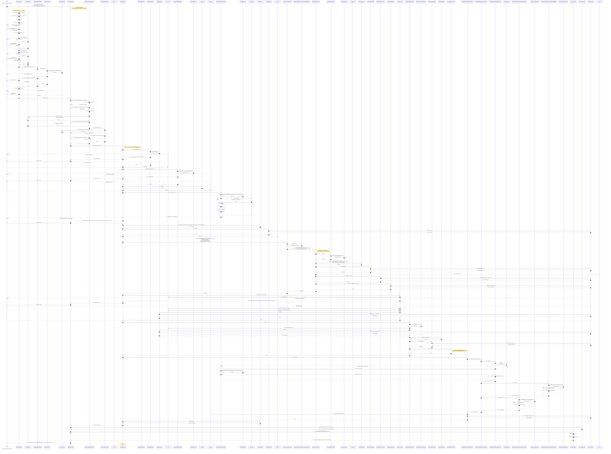

# Diagrama de Secuencia: Venta de Acciones

```mermaid
%%{init: {'version': '11.12.1'}}%%
sequenceDiagram
    autonumber
    actor U as Estudiante (ROLE_STUDENT)
    participant JA as JwtSessionAspect
    participant JS as IJwtService
    participant UES as UserExistsByEmailService
    participant UExS as UserExistsService
    participant UR as IUserRepository
    participant C as StockSellController
    participant SUAR as SessionUserArgumentResolver
    participant UGS as IUserGetByEmailService
    participant User as User
    participant Svc as StockSellService
    participant stockDto as StockBuyRequestDto
    participant SFind as StockFindByIdService
    participant StockRepo as IStockRepository
    participant Stock as Stock
    participant SGES as StudentGetByEmailService
    participant SR as IStudentRepository
    participant ST as Student
    participant Wallet as Wallet
    participant SCBW as StockCalculateByWalletService
    participant OR as IOrderRepository
    participant Orders as List<Order>
    participant OrderMapper as OrderMapper
    participant OrderRepo as IOrderRepository
    participant Order as Order
    participant TG as TransactionGenerateService
    participant STR as strategies<Map<String,ITransactionStrategyService>>
    participant STS as StockTransactionService
    participant ReserveFind as ReserveFindLastService
    participant ReserveRepo as IReserveRepository
    participant Reserve as Reserve
    participant TM as TransactionMapper
    participant TR as ITransactionRepository
    participant WAdd as IWalletAddAmountService
    participant RM as IReserveModifyService
    participant StockMove as StockMoveService
    participant StockUpdate as StockUpdateSpecificService
    participant SCV as StockCalculateVariationService
    participant SHRepo as IStockHistoryRepository
    participant StockHistoryMapper as StockHistoryMapper
    participant OrderStop as IOrderStopExecuteService
    participant WalletUpdate as WalletUpdateInvestedBalanceService
    participant InvestCalc as InvestemtCalculateTotalInvestedService
    participant StockInv as StockCalculateAmountInvestedService
    participant StockRepo2 as IStockRepository
    participant SAInv as SavingAccountCalculateAmountInvestedService
    participant SARepo as ISavingAccountRepository
    participant FTInv as FixedTermDepositCalculateAmountInvestedService
    participant FTRepo as IFixedTermDepositRepository
    participant Resp as ResponseFactory
    participant SM as SuccessfulMessages
    participant DB as Base de Datos

    U->>C: POST /investment/stocks/sell<br/>Body: StockBuyRequestDto{stockId, quantity}<br/>Header: Authorization: Bearer {jwt}
    Note right of C: @PostMapping("/sell")<br/>@SessionRequired(roles = {ROLE_STUDENT})

    Note over JA: Interceptor ejecutado antes del método
    JA->>JA: validateJwt(joinPoint, sessionRequired)
    JA->>JA: RequestContextHolder.getRequestAttributes()
    JA->>JA: attrs.getRequest()
    JA->>JA: request.getHeader("Authorization")
    alt Header ausente o formato != Bearer
        JA-->>U: 401 Unauthorized<br/>(INVALID_ACCESS_TOKEN)
    else Header válido
        JA->>JA: jwt = authHeader.substring(7)
    end
    JA->>JS: isTokenExpired(jwt)
    alt Token expirado
        JS-->>JA: JwtException
        JA-->>U: 401 Unauthorized<br/>(TOKEN_EXPIRED)
    else Vigente
        JS-->>JA: false
    end
    JA->>JS: extractRole(jwt)
    JA->>JS: extractUsername(jwt)
    alt Firma inválida
        JS-->>JA: JwtException
        JA-->>U: 401 Unauthorized<br/>(INVALID_ACCESS_TOKEN)
    else Credenciales válidas
        JS-->>JA: role
        JS-->>JA: email
    end
    JA->>UES: validateIfUserIsActive(email)
    UES->>UExS: validate(email)
    UExS->>UR: existsByEmailAndDeletedAtIsNull(email)
    UR-->>UExS: boolean
    alt Usuario inactivo/no existe
        UExS-->>UES: false
        UES-->>JA: UnauthorizedException(UNAUTHORIZED)
        JA-->>U: 401 Unauthorized
    else Usuario activo
        UExS-->>UES: true
        UES-->>JA: ok
    end
    JA->>JA: requiredRoles.contains(role)
    alt Rol no permitido
        JA-->>U: 401 Unauthorized<br/>(requiredRoles)
    else Rol válido
        JA-->>C: validación exitosa
    end

    C->>SUAR: resolveArgument(@SessionUser User, request)
    SUAR->>SUAR: request.getHeader("Authorization")
    alt Header nulo o inválido
        SUAR-->>C: UnauthorizedException(INVALID_ACCESS_TOKEN)
    else Header válido
        SUAR->>SUAR: jwt = authHeader.substring(7)
    end
    SUAR->>JS: extractUsername(jwt)
    alt Error al parsear JWT
        JS-->>SUAR: Exception
        SUAR-->>C: UnauthorizedException(INVALID_ACCESS_TOKEN)
    else Username obtenido
        JS-->>SUAR: email
    end
    SUAR->>UGS: findUserByEmail(email)
    UGS->>UR: findByEmailAndDeletedAtIsNull(email)
    UR-->>UGS: Optional<User>
    alt Usuario no encontrado
        UGS-->>SUAR: UnauthorizedException(UNAUTHORIZED)
        SUAR-->>C: UnauthorizedException(UNAUTHORIZED)
    else Usuario encontrado
        UGS-->>SUAR: User
        SUAR-->>C: User
    end

    C->>Svc: cu90sellStock(stockDto, user)
    Note right of Svc: stockDto.stockId(Long), stockDto.quantity(BigInteger)

    Svc->>SFind: execute(stockDto.stockId)
    SFind->>StockRepo: findById(stockId)
    StockRepo-->>SFind: Optional<Stock>
    alt Stock no encontrado
        SFind-->>Svc: NotFoundException("Accion no encontrada")
        Svc-->>C: NotFoundException
        C-->>U: 404 Not Found
    else Stock encontrado
        SFind-->>Svc: Stock
        Svc-->>Stock: referencia
    end

    Svc->>SGES: getByEmail(user.getEmail())
    SGES->>SR: findByUserEmailAndDeletedAtIsNull(email)
    SR-->>SGES: Optional<Student>
    alt Estudiante no encontrado
        SGES-->>Svc: NotFoundException
        Svc-->>C: NotFoundException
        C-->>U: 404 Not Found
    else Estudiante encontrado
        SGES-->>Svc: Student
        Svc->>ST: getWallet()
        ST-->>Svc: Wallet
        Svc-->>Wallet: referencia
    end

    Svc->>SCBW: execute(stock, wallet)
    SCBW->>OR: findByWalletAndStockAndOrderState(wallet, stock, EJECUTADA)
    OR-->>SCBW: List<Order>
    SCBW-->>Orders: consolidar historial
    loop Iterar órdenes ejecutadas
        Orders->>SCBW: Order
        alt orderType == COMPRA
            SCBW-->>SCBW: total = total + quantity
        else orderType == VENTA
            SCBW-->>SCBW: total = total - quantity
        end
    end
    SCBW-->>Svc: BigInteger totalAccionesWallet
    alt totalAccionesWallet < stockDto.quantity
        Svc-->>C: BadRequestException("El wallet no cuenta con las acciones suficientes para realizar la venta")
        C-->>U: 400 Bad Request
    end

    Svc->>OrderMapper: toEntity(OrderType.VENTA, OrderState.EJECUTADA, stock, wallet, stockDto.quantity)
    OrderMapper-->>Svc: Order nuevo
    Svc->>OrderRepo: save(order)
    OrderRepo->>DB: INSERT orders (...)
    DB-->>OrderRepo: Order persisted
    OrderRepo-->>Svc: Order
    Svc-->>Order: referencia

    Svc->>TG: generate(TypeTransaction.STOCK,<br/>amount = stock.currentPrice * stockDto.quantity.doubleValue(),<br/>"Venta de acciones",<br/>TransactionActor.SISTEMA,<br/>TransactionActor.ESTUDIANTE,<br/>wallet,null,null,null,order,null,null)
    TG->>STR: get("STOCK")
    STR-->>TG: StockTransactionService
    TG->>STS: execute(amount,"Venta de acciones",<br/>TransactionActor.SISTEMA, TransactionActor.ESTUDIANTE,<br/>wallet,null,null,null,order,null,null)
    Note right of STS: Estrategia (Strategy Pattern)<br/>Controla flujo económico de compra/venta

    STS->>ReserveFind: get()
    ReserveFind->>ReserveRepo: findFirstByOrderByCreatedAtDesc()
    ReserveRepo-->>ReserveFind: Optional<Reserve>
    ReserveFind-->>STS: Reserve
    STS->>TM: toModel(amount,"Venta de acciones",<br/>TransactionActor.SISTEMA, TransactionActor.ESTUDIANTE,<br/>wallet,null,null,null,order,null,null,reserve)
    TM-->>STS: Transaction
    STS->>TR: save(transaction)
    TR->>DB: INSERT transactions (...)
    DB-->>TR: Transaction persisted
    TR-->>STS: Transaction
    STS-->>SVC: Transaction saved
    STS->>WAdd: execute(wallet, amount)
    WAdd->>DB: UPDATE wallets.balance += amount
    DB-->>WAdd: Wallet actualizado
    WAdd-->>STS: Wallet
    STS->>RM: moveToCirculation(amount, reserve)
    RM->>DB: UPDATE reserve (balances)
    DB-->>RM: Reserve actualizado
    RM-->>STS: Reserve
    STS-->>TG: Transaction
    TG-->>Svc: Transaction

    Svc->>StockMove: toAvailable(stock, order.quantity)
    StockMove->>Stock: getSoldAmount()
    alt soldAmount < order.quantity
        StockMove-->>Svc: BadRequestException("No hay acciones vendidas suficientes para mover a disponibles.")
        Svc-->>C: BadRequestException
        C-->>U: 400 Bad Request
    else Cantidad suficiente
        StockMove->>Stock: setSoldAmount(soldAmount - quantity)
        StockMove->>Stock: setAvailableAmount(available + quantity)
        StockMove->>StockRepo: save(stock)
        StockRepo->>DB: UPDATE stocks (... sold/available ...)
        DB-->>StockRepo: Stock actualizado
        StockRepo-->>StockMove: Stock
        StockMove-->>Svc: void
    end

    Svc->>StockUpdate: execute(stock)
    StockUpdate->>SCV: execute(stock)
    SCV-->>StockUpdate: variation (%)
    StockUpdate->>Stock: setCurrentPrice(min(max(...)))
    StockUpdate->>StockRepo: save(stock)
    StockRepo->>DB: UPDATE stocks (current_price)
    DB-->>StockRepo: Stock actualizado
    StockRepo-->>StockUpdate: Stock actualizado
    StockUpdate->>StockHistoryMapper: toModel(stock, variation)
    StockHistoryMapper-->>StockUpdate: StockHistory
    StockUpdate->>SHRepo: save(stockHistory)
    SHRepo->>DB: INSERT stock_histories (...)
    DB-->>SHRepo: StockHistory persisted
    SHRepo-->>StockUpdate: StockHistory
    StockUpdate->>OrderStop: execute(stock)
    Note right of OrderStop: Evalúa órdenes stop pendientes<br/>ejecuta transacciones adicionales si corresponde
    OrderStop-->>StockUpdate: void
    StockUpdate-->>Svc: void

    Svc->>WalletUpdate: execute(wallet)
    WalletUpdate->>InvestCalc: cu110calculateTotalInvested(wallet)
    InvestCalc->>StockInv: execute(wallet)
    StockInv->>StockRepo2: findAll()
    StockRepo2-->>StockInv: Iterable<Stock>
    loop Calcular inversión en cada stock
        StockInv->>SCBW: execute(stock, wallet)
        SCBW->>OR: findByWalletAndStockAndOrderState(wallet, stock, EJECUTADA)
        OR-->>SCBW: List<Order>
        SCBW-->>StockInv: BigInteger cantidad
        StockInv-->>StockInv: total += stock.currentPrice * cantidad.doubleValue()
    end
    StockInv-->>InvestCalc: Double invertidoStocks
    InvestCalc->>FTInv: execute(wallet)
    FTInv->>FTRepo: findByFixedTermState(IN_PROGRESS)
    FTRepo-->>FTInv: List<FixedTermDeposit>
    loop Sumar plazos fijos activos
        FTInv-->>FTInv: total += fixedTermDeposit.amountReward
    end
    FTInv-->>InvestCalc: Double invertidoPlazoFijo
    InvestCalc->>SAInv: execute(wallet)
    SAInv->>SARepo: findAllByWalletAndDeletedAtIsNull(wallet)
    SARepo-->>SAInv: List<SavingAccount>
    loop Sumar cajas de ahorro
        SAInv-->>SAInv: total += savingAccount.currentAmount
    end
    SAInv-->>InvestCalc: Double invertidoCajas
    InvestCalc-->>WalletUpdate: Double totalInvertido
    WalletUpdate->>Wallet: setInvertedBalance(totalInvertido)
    WalletUpdate->>DB: UPDATE wallets.inverted_balance
    DB-->>WalletUpdate: Wallet actualizado
    WalletUpdate-->>Svc: void

    Svc->>OrderMapper: toSellDto(order)
    OrderMapper-->>Svc: StockSellResponseDto
    Svc-->>C: StockSellResponseDto

    C->>SM: createdSuccessfully("Orden de venta de accion")
    SM-->>C: "Orden de venta de accion creado correctamente"
    C->>Resp: created(StockSellResponseDto,<br/>"Orden de venta de accion creado correctamente")
    Resp->>Resp: BaseResponse.builder()...
    Resp->>Resp: ResponseEntity.status(201)
    Resp-->>C: ResponseEntity<BaseResponse<StockSellResponseDto>>
    C-->>U: 201 Created<br/>BaseResponse{data: StockSellResponseDto, message, errors:null, timestamp}

    note over Svc: finCU()

```

