# Stock Update Sequence Diagram

## Descripción

Este diagrama documenta el flujo completo del caso de uso **CU78 - Actualización de Stocks** (`cu78updateStock`). Este proceso se ejecuta automáticamente mediante un scheduler de Spring todos los días a la 1:00 AM.

El flujo incluye:
1. Obtención de todos los stocks del sistema
2. Para cada stock:
   - Cálculo de variación de precio basado en riesgo, tendencia y ventas recientes
   - Actualización del precio del stock (con límites superior e inferior)
   - Guardado del historial de precios
   - Ejecución de órdenes stop (pérdida/ganancia) pendientes
3. Para cada orden ejecutada:
   - Generación de transacción
   - Actualización de wallet del estudiante
   - Movimiento de acciones de vendidas a disponibles
   - Actualización del saldo invertido del wallet

## Diagrama de Secuencia

```mermaid
%%{init: {'version': '11.12.1'}}%%
sequenceDiagram
    autonumber
    participant Scheduler as Spring Scheduler
    participant SUS as StockUpdateService
    participant SFAS as StockFindAllService
    participant SR as IStockRepository
    participant SUSp as StockUpdateSpecificService
    participant SCVS as StockCalculateVariationService
    participant SHFLS as StockHistoryFindLastService
    participant SHR as IStockHistoryRepository
    participant SHCTS as StockHistoryCalculateTrendService
    participant SHM as StockHistoryMapper
    participant OSE as OrderStopExecuteService
    participant OR as IOrderRepository
    participant SCBWS as StockCalculateByWalletService
    participant SMS as StockMoveService
    participant TGS as TransactionGenerateService
    participant STS as StockTransactionService
    participant TM as TransactionMapper
    participant TR as ITransactionRepository
    participant WAAS as WalletAddAmountService
    participant RMS as ReserveModifyService
    participant RFLS as ReserveFindLastService
    participant WUIS as WalletUpdateInvestedBalanceService
    participant ICIS as InvestmentCalculateTotalInvestedService
    participant SCAIS as StockCalculateAmountInvestedService
    participant WR as IWalletRepository
    participant Stock as Stock
    participant StockHistory as StockHistory
    participant Order as Order
    participant Wallet as Wallet
    participant Transaction as Transaction
    participant Reserve as Reserve

    Scheduler->>SUS: cu78updateStock()
    activate SUS
    SUS->>SFAS: execute()
    activate SFAS
    SFAS->>SR: findAll()
    activate SR
    SR-->>SFAS: Iterable<Stock>
    deactivate SR
    SFAS-->>SUS: Iterable<Stock>
    deactivate SFAS
    
    loop Para cada Stock
        SUS->>SUSp: execute(stock)
        activate SUSp
        
        SUSp->>SCVS: execute(stock)
        activate SCVS
        
        SCVS->>SHFLS: execute(stock)
        activate SHFLS
        SHFLS->>SHR: findTopByStockOrderByCreatedAtDesc(stock)
        activate SHR
        SHR-->>SHFLS: Optional<StockHistory>
        deactivate SHR
        SHFLS-->>SCVS: StockHistory (lastHistory)
        deactivate SHFLS
        
        SCVS->>Stock: getSoldAmount()
        Stock-->>SCVS: BigInteger soldAmount
        SCVS->>StockHistory: getSoldAmount()
        StockHistory-->>SCVS: BigInteger lastSoldAmount
        SCVS->>Stock: getTotalAmount()
        Stock-->>SCVS: BigInteger totalAmount
        SCVS->>Stock: getRiskLevel()
        Stock-->>SCVS: RiskLevel riskLevel
        
        SCVS->>SHCTS: execute(stock)
        activate SHCTS
        SHCTS->>SHR: findTop10ByStockOrderByCreatedAtAsc(stock)
        activate SHR
        SHR-->>SHCTS: List<StockHistory>
        deactivate SHR
        SHCTS-->>SCVS: boolean (tendencia alcista)
        deactivate SHCTS
        
        Note over SCVS: Calcula variación aleatoria<br/>basada en riesgo, sesgo y tendencia
        SCVS-->>SUSp: Double variation
        deactivate SCVS
        
        Note over SUSp: Calcula nuevo precio:<br/>newPrice = min(max(currentPrice * (1 + variation/100), 10.0), initialPrice * 2.5)
        SUSp->>Stock: setCurrentPrice(newPrice)
        SUSp->>SR: save(stock)
        activate SR
        SR-->>SUSp: Stock (stockUpdated)
        deactivate SR
        
        SUSp->>SHM: toModel(stockUpdated, variation)
        activate SHM
        SHM-->>SUSp: StockHistory
        deactivate SHM
        SUSp->>SHR: save(stockHistory)
        activate SHR
        SHR-->>SUSp: StockHistory
        deactivate SHR
        
        SUSp->>OSE: execute(stockUpdated)
        activate OSE
        
        OSE->>OR: findByStockAndOrderStateOrderByCreatedAtAsc(stock, PENDIENTE)
        activate OR
        OR-->>OSE: List<Order>
        deactivate OR
        
        alt Si orders está vacía
            OSE-->>SUSp: return (sin hacer nada)
        else Para cada Order pendiente
            loop Para cada Order
                OSE->>SHFLS: execute(stock)
                activate SHFLS
                SHFLS->>SHR: findTopByStockOrderByCreatedAtDesc(stock)
                activate SHR
                SHR-->>SHFLS: Optional<StockHistory>
                deactivate SHR
                SHFLS-->>OSE: StockHistory (stockHistory)
                deactivate SHFLS
                
                OSE->>Order: getOrderStop()
                Order-->>OSE: OrderStop (LOSS o PROFIT)
                OSE->>Order: getPricePerUnit()
                Order-->>OSE: Double pricePerUnit
                OSE->>StockHistory: getPrice()
                StockHistory-->>OSE: Double price
                
                alt Si orden no debe ejecutarse
                    Note over OSE: Condición: (LOSS && price >= orderPrice) ||<br/>(PROFIT && price <= orderPrice)
                    OSE-->>OSE: continue (siguiente orden)
                else Validar acciones disponibles
                    OSE->>Order: getWallet()
                    Order-->>OSE: Wallet wallet
                    OSE->>SCBWS: execute(stock, wallet)
                    activate SCBWS
                    SCBWS->>OR: findByWalletAndStockAndOrderState(wallet, stock, EJECUTADA)
                    activate OR
                    OR-->>SCBWS: List<Order>
                    deactivate OR
                    Note over SCBWS: Calcula cantidad total de acciones<br/>del wallet para este stock
                    SCBWS-->>OSE: BigInteger (cantidad disponible)
                    deactivate SCBWS
                    
                    OSE->>Order: getQuantity()
                    Order-->>OSE: BigInteger quantity
                    
                    alt Si cantidad disponible < cantidad requerida
                        OSE->>Order: setOrderState(CANCELADA)
                        OSE->>OR: save(order)
                        activate OR
                        OR-->>OSE: Order
                        deactivate OR
                        OSE-->>OSE: continue (siguiente orden)
                    else Ejecutar orden
                        OSE->>Order: setOrderState(EJECUTADA)
                        OSE->>Order: setPricePerUnit(stockHistory.getPrice())
                        OSE->>OR: save(order)
                        activate OR
                        OR-->>OSE: Order
                        deactivate OR
                        
                        OSE->>TGS: generate(TypeTransaction.STOCK, amount, "Venta de acciones", TransactionActor.SISTEMA, TransactionActor.ESTUDIANTE, wallet, null, null, null, order, null, null)
                        activate TGS
                        TGS->>STS: execute(amount, description, origin, destination, wallet, null, null, null, order, null, null)
                        activate STS
                        
                        STS->>RFLS: get()
                        activate RFLS
                        RFLS-->>STS: Reserve
                        deactivate RFLS
                        
                        Note over STS: order.getOrderType() == VENTA
                        STS->>TM: toModel(amount, description, origin, destination, wallet, null, null, null, order, null, null, reserve)
                        activate TM
                        TM-->>STS: Transaction
                        deactivate TM
                        
                        STS->>TR: save(transaction)
                        activate TR
                        TR-->>STS: Transaction
                        deactivate TR
                        
                        STS->>WAAS: execute(wallet, amount)
                        activate WAAS
                        WAAS->>Wallet: addBalance(amount)
                        WAAS->>WR: save(wallet)
                        activate WR
                        WR-->>WAAS: Wallet
                        deactivate WR
                        WAAS-->>STS: void
                        deactivate WAAS
                        
                        STS->>RMS: moveToCirculation(amount, reserve)
                        activate RMS
                        RMS->>Reserve: moveToCirculation(amount)
                        RMS-->>STS: void
                        deactivate RMS
                        
                        STS-->>TGS: Transaction
                        deactivate STS
                        TGS-->>OSE: Transaction
                        deactivate TGS
                        
                        OSE->>SMS: toAvailable(stock, quantity)
                        activate SMS
                        SMS->>Stock: getSoldAmount()
                        Stock-->>SMS: BigInteger soldAmount
                        SMS->>Stock: getAvailableAmount()
                        Stock-->>SMS: BigInteger availableAmount
                        SMS->>Stock: setSoldAmount(soldAmount.subtract(quantity))
                        SMS->>Stock: setAvailableAmount(availableAmount.add(quantity))
                        SMS->>SR: save(stock)
                        activate SR
                        SR-->>SMS: Stock
                        deactivate SR
                        SMS-->>OSE: void
                        deactivate SMS
                        
                        OSE->>WUIS: execute(wallet)
                        activate WUIS
                        WUIS->>ICIS: cu110calculateTotalInvested(wallet)
                        activate ICIS
                        ICIS->>SCAIS: execute(wallet)
                        activate SCAIS
                        SCAIS->>SR: findAll()
                        activate SR
                        SR-->>SCAIS: Iterable<Stock>
                        deactivate SR
                        loop Para cada Stock
                            SCAIS->>Stock: getCurrentPrice()
                            Stock-->>SCAIS: Double currentPrice
                            SCAIS->>SCBWS: execute(stock, wallet)
                            activate SCBWS
                            SCBWS->>OR: findByWalletAndStockAndOrderState(wallet, stock, EJECUTADA)
                            activate OR
                            OR-->>SCBWS: List<Order>
                            deactivate OR
                            SCBWS-->>SCAIS: BigInteger quantity
                            deactivate SCBWS
                            Note over SCAIS: total += currentPrice * quantity
                        end
                        SCAIS-->>ICIS: Double (total invertido en stocks)
                        deactivate SCAIS
                        Note over ICIS: Suma: stocks + fixedTermDeposits + savingAccounts
                        ICIS-->>WUIS: Double (total invertido)
                        deactivate ICIS
                        WUIS->>Wallet: setInvertedBalance(total)
                        WUIS->>WR: save(wallet)
                        activate WR
                        WR-->>WUIS: Wallet
                        deactivate WR
                        WUIS-->>OSE: void
                        deactivate WUIS
                    end
                end
            end
        end
        
        OSE-->>SUSp: void
        deactivate OSE
        SUSp-->>SUS: void
        deactivate SUSp
    end
    
    deactivate SUS
    note over Scheduler SUS SR OSE WR: finCU()
```

## Participantes

### Servicios Principales
- **StockUpdateService**: Servicio principal que orquesta la actualización de todos los stocks. Se ejecuta mediante scheduler.
- **StockFindAllService**: Obtiene todos los stocks del sistema.
- **StockUpdateSpecificService**: Actualiza un stock específico: calcula variación, actualiza precio y guarda historial.
- **StockCalculateVariationService**: Calcula la variación de precio basada en riesgo, tendencia y ventas recientes.
- **OrderStopExecuteService**: Ejecuta órdenes stop (pérdida/ganancia) pendientes cuando se cumplen las condiciones.

### Servicios de Soporte
- **StockHistoryFindLastService**: Obtiene el último registro de historial de un stock.
- **StockHistoryCalculateTrendService**: Calcula la tendencia alcista/bajista basada en las últimas 10 variaciones.
- **StockCalculateByWalletService**: Calcula la cantidad de acciones que tiene un wallet para un stock específico.
- **StockMoveService**: Mueve acciones entre estados (vendidas ↔ disponibles).
- **TransactionGenerateService**: Genera transacciones usando el patrón Strategy.
- **StockTransactionService**: Estrategia de transacción para operaciones con stocks (Strategy Pattern).
- **WalletUpdateInvestedBalanceService**: Actualiza el saldo invertido de un wallet.
- **InvestmentCalculateTotalInvestedService**: Calcula el total invertido en todos los tipos de inversión.
- **StockCalculateAmountInvestedService**: Calcula el monto invertido en stocks para un wallet.

### Repositorios
- **IStockRepository**: Repositorio de stocks.
- **IStockHistoryRepository**: Repositorio de historial de stocks.
- **IOrderRepository**: Repositorio de órdenes.
- **ITransactionRepository**: Repositorio de transacciones.
- **IWalletRepository**: Repositorio de wallets.

### Mappers
- **StockHistoryMapper**: Mapea entre Stock y StockHistory.

### Entidades
- **Stock**: Entidad que representa una acción.
- **StockHistory**: Entidad que almacena el historial de precios de un stock.
- **Order**: Entidad que representa una orden de compra/venta.
- **Wallet**: Entidad que representa la billetera de un estudiante.
- **Transaction**: Entidad que representa una transacción económica.
- **Reserve**: Entidad que representa la reserva del sistema.

## Flujo Detallado

### 1. Trigger del Scheduler
El proceso se inicia automáticamente todos los días a la 1:00 AM mediante la anotación `@Scheduled(cron = "0 0 1 * * *")` en el método `cu78updateStock()`.

### 2. Obtención de Stocks
Se obtienen todos los stocks del sistema mediante `StockFindAllService`, que utiliza `IStockRepository.findAll()`.

### 3. Actualización de Cada Stock
Para cada stock en el sistema:

#### 3.1. Cálculo de Variación
- Se obtiene el último registro de historial del stock.
- Se calcula el cambio en las ventas de acciones desde el último historial.
- Se calcula un sesgo basado en el cambio de ventas.
- Se obtiene la tendencia (alcista/bajista) basada en las últimas 10 variaciones.
- Se calcula un rango de variación basado en:
  - El nivel de riesgo del stock (BAJO: 5%, MEDIO: 10%, ALTO: 15%)
  - El sesgo calculado
  - La tendencia (ajusta el rango)
- Se genera un valor aleatorio dentro del rango calculado.

#### 3.2. Actualización de Precio
- Se calcula el nuevo precio aplicando la variación: `currentPrice * (1 + variation / 100)`
- Se aplican límites:
  - **Límite inferior**: 10.0 (precio mínimo)
  - **Límite superior**: `initialPrice * 2.5` (máximo 2.5 veces el precio inicial)
- Se actualiza el stock con el nuevo precio.

#### 3.3. Guardado de Historial
- Se crea un nuevo registro de `StockHistory` con:
  - El stock actualizado
  - El precio actual
  - La cantidad disponible
  - La cantidad vendida
  - La variación calculada
  - La fecha y hora actual

### 4. Ejecución de Órdenes Stop
Para cada stock actualizado, se buscan todas las órdenes pendientes (`PENDIENTE`) asociadas a ese stock.

#### 4.1. Validación de Condiciones
Para cada orden pendiente:
- Se obtiene el último historial del stock (con el precio actualizado).
- Se valida si la orden debe ejecutarse:
  - **Orden de PÉRDIDA (LOSS)**: Se ejecuta si el precio actual es **menor** que el precio de la orden.
  - **Orden de GANANCIA (PROFIT)**: Se ejecuta si el precio actual es **mayor** que el precio de la orden.
- Si la condición no se cumple, se omite la orden (continue).

#### 4.2. Validación de Acciones Disponibles
- Se calcula la cantidad de acciones que el wallet tiene para el stock (sumando todas las órdenes ejecutadas).
- Si la cantidad disponible es menor que la cantidad requerida por la orden:
  - Se cancela la orden (`CANCELADA`).
  - Se guarda la orden cancelada.
  - Se omite la orden (continue).

#### 4.3. Ejecución de la Orden
Si todas las validaciones pasan:
1. **Actualización de Estado**: Se cambia el estado de la orden a `EJECUTADA` y se actualiza el precio por unidad al precio actual del stock.
2. **Generación de Transacción**: Se genera una transacción de tipo `STOCK` mediante `TransactionGenerateService`, que utiliza la estrategia `StockTransactionService`:
   - Se obtiene la última reserva del sistema.
   - Se crea la transacción mediante `TransactionMapper`.
   - Se guarda la transacción.
   - Se agrega el monto al wallet del estudiante.
   - Se mueve el monto de la reserva a circulación.
3. **Movimiento de Acciones**: Se mueven las acciones de `soldAmount` a `availableAmount` mediante `StockMoveService`.
4. **Actualización de Saldo Invertido**: Se actualiza el saldo invertido del wallet:
   - Se calcula el total invertido en todos los tipos de inversión (stocks, plazo fijo, cuenta de ahorros).
   - Se actualiza el campo `invertedBalance` del wallet.

## Consideraciones Importantes

### Transaccionalidad
- Todo el proceso de actualización de un stock está envuelto en una transacción (`@Transactional`), garantizando la atomicidad de las operaciones.

### Límites de Precio
- El precio de un stock nunca puede ser menor a 10.0.
- El precio de un stock nunca puede superar 2.5 veces su precio inicial.

### Ejecución de Órdenes
- Las órdenes se ejecutan en orden de creación (ordenadas por `createdAt` ascendente).
- Solo se ejecutan órdenes que están en estado `PENDIENTE`.
- Las órdenes se validan individualmente; si una orden no puede ejecutarse, se continúa con la siguiente.

### Cálculo de Variación
- La variación es aleatoria pero está influenciada por:
  - El nivel de riesgo del stock
  - Las ventas recientes (sesgo)
  - La tendencia histórica (últimas 10 variaciones)
- Una tendencia alcista reduce la probabilidad de variaciones negativas.
- Una tendencia bajista reduce la probabilidad de variaciones positivas.

## Casos de Uso Relacionados

- **CU77**: Registro de Stock (`cu77registerStock`)
- **CU86**: Listar Stocks (`cu86listStocks`)
- **CU79**: Obtener Historial de Stock (`cu79getStockHistories`)
- **CU100**: Obtener Stock (`cu100GetStock`)
- **CU110**: Calcular Total Invertido (`cu110calculateTotalInvested`)

## Referencias

- [`StockUpdateService.java`](../../src/main/java/trinity/play2learn/backend/investment/stock/services/StockUpdateService.java)
- [`StockUpdateSpecificService.java`](../../src/main/java/trinity/play2learn/backend/investment/stock/services/commons/StockUpdateSpecificService.java)
- [`StockCalculateVariationService.java`](../../src/main/java/trinity/play2learn/backend/investment/stock/services/commons/StockCalculateVariationService.java)
- [`OrderStopExecuteService.java`](../../src/main/java/trinity/play2learn/backend/investment/stock/services/commons/OrderStopExecuteService.java)

