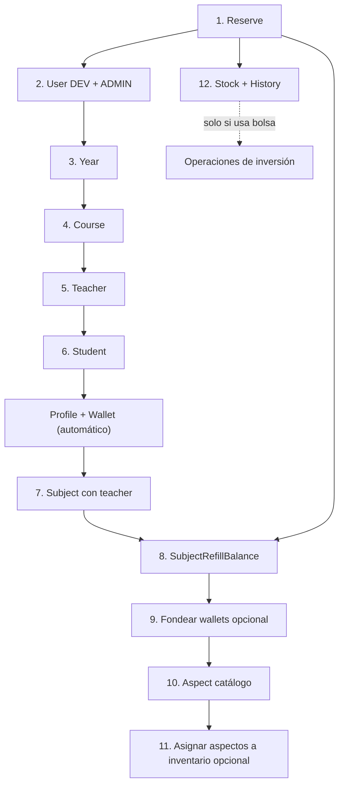

# Informe: modelos con datos obligatorios para el funcionamiento correcto

> Contexto: tras cambiar `spring.jpa.hibernate.ddl-auto` de `update` a `create`, la base de datos arranca vacía. Este documento identifica qué entidades **deben** poblarse antes de que la aplicación sea usable, y en qué orden.

---

## Resumen ejecutivo

| Prioridad | Entidad | ¿Obligatoria? | Motivo |
|-----------|---------|---------------|--------|
| **P0** | `Reserve` | **Sí** | Todas las transacciones económicas consultan la "última reserva". Sin ella → `NotFoundException`. |
| **P1** | `User` (DEV / ADMIN) | **Sí** | Sin usuarios operativos no hay login ni gestión del sistema. |
| **P1** | `Year` → `Course` | **Sí** | FK obligatoria: estudiantes y materias requieren curso; curso requiere año. |
| **P2** | `Teacher` | **Sí (operativo)** | Materias sin docente provocan NPE en actividades, beneficios y notificaciones. |
| **P2** | `Student` (+ `Profile` + `Wallet`) | **Sí (operativo)** | Flujos de alumno, economía, avatar e inversiones requieren wallet y perfil. |
| **P2** | `Subject` (+ saldo) | **Sí (operativo)** | Actividades/recompensas fallan sin saldo en materia. |
| **P3** | `Aspect` | **Recomendado** | Avatar/tienda vacíos sin catálogo. No bloquea el arranque. |
| **P3** | `Stock` + `StockHistory` | **Condicional** | Solo si se usa el módulo de bolsa. Cada stock necesita historial inicial. |

**No requieren seed:** enums Java (`Role`, `TypeTransaction`, `TypeAspect`, etc.), entidades transaccionales (`Transaction`, `Activity`, `Benefit`, `Order`, etc.).

---

## 1. P0 — Singleton global: Reserve

**Ruta:** `economy/reserve/models/Reserve.java`

**Por qué es obligatoria**

`ReserveFindLastService` obtiene la reserva más reciente con `findFirstByOrderByCreatedAtDesc()`. Si la tabla está vacía, lanza:

```
NotFoundException: Reserva con id ultima no encontrado
```

**Servicios que dependen de ella (no exhaustivo):**

- Estrategias de transacción: `CompraTransactionService`, `RecompensaTransactionService`, `AsignacionTransactionService`, `ActividadTransactionService`, `ReembolsoTransactionService`, `ReinicioWalletTransactionService`, `DepositSavingAccountTransactionService`, `WithdrawalSavingAccountTransactionService`, `StockTransactionService`, `FixedTermDepositTransactionService`
- `ReserveCreateNewService` / `WalletRestartService` (clonan la última reserva)
- `StatisticsHomeAdminService` (dashboard admin)

**Mínimo necesario:** 1 registro con balances coherentes.

```java
Reserve.builder()
    .initialBalance(1_000_000.0)
    .reserveBalance(1_000_000.0)
    .circulationBalance(0.0)
    .build();
```

**Dependencias previas:** ninguna.

**Utilidad reutilizable:** `EconomyTestMother.defaultReserve()`.

---

## 2. P1 — Usuarios operativos: User (DEV y ADMIN)

**Ruta:** `user/models/User.java`

**Por qué es obligatorio**

- Login JWT requiere usuarios existentes.
- Endpoints de administración exigen `ROLE_ADMIN` o `ROLE_DEV`.
- El registro de docentes/estudiantes crea usuarios adicionales, pero los operadores del sistema deben existir primero.

**Mínimo necesario:**

| Usuario | Rol | Credenciales sugeridas |
|---------|-----|------------------------|
| Dev | `ROLE_DEV` | `dev@gmail.com` / `12345678` |
| Admin | `ROLE_ADMIN` | `admin@gmail.com` / `12345678` |

**Dependencias previas:** ninguna.

**Nota:** docentes y estudiantes usan `UserCreateService.create(email, dni, role)` → la contraseña inicial es el **DNI**.

---

## 3. P1 — Estructura académica base: Year → Course

### Year

**Ruta:** `admin/year/models/Year.java`

**Por qué es obligatorio:** `Course` tiene FK obligatoria `year_id`. Sin años no se pueden registrar cursos.

**Mínimo:** 1 año. Para desarrollo: 6 años (Primero a Sexto).

### Course

**Ruta:** `admin/course/models/Course.java`

**Por qué es obligatorio:** `Student` requiere `course_id`. Materias, beneficios y actividades referencian curso.

**Mínimo:** 1 curso por año usado. Para desarrollo: máx. 2 cursos por año (p. ej. "A" y "B").

**Dependencias:** `Year` → `Course`.

---

## 4. P2 — Cadena operativa: Teacher → Student → Subject

### Teacher

**Ruta:** `admin/teacher/models/Teacher.java`

**Por qué es obligatorio (operativamente)**

Aunque `Subject.teacher_id` puede ser null al registrar, múltiples servicios hacen `subject.getTeacher().equals(teacher)` sin null-check:

- Generación de actividades (Memorama, Ahorcado, Preguntados, etc.)
- Beneficios (`BenefitGenerateService`, `BenefitDeleteService`, compras, aceptación de uso)
- Notificaciones

**Sin docente asignado → NullPointerException** al intentar crear actividades o beneficios.

**Mínimo:** al menos 1 docente; idealmente suficientes para asignar a cada materia (pueden reutilizarse entre materias/cursos).

**Dependencias:** `User` con `ROLE_TEACHER` (creado automáticamente por `TeacherRegisterService`).

### Student + Profile + Wallet (cascada automática)

**Rutas:**
- `admin/student/models/Student.java`
- `profile/profile/models/Profile.java`
- `economy/wallet/models/Wallet.java`

**Por qué es obligatorio (operativamente)**

Casi todos los flujos de alumno acceden a `student.getWallet()` y `student.getProfile()`:

- Transacciones, compras, beneficios
- Inversiones (caja de ahorro, plazo fijo, acciones)
- Avatar y ranking

**Qué rompe sin datos:** cualquier operación económica o de perfil del alumno.

**Mínimo:** al menos 1 estudiante registrado vía `StudentRegisterService`.

**Cascada en registro** (`StudentRegisterService`):

1. Crea `User` (`ROLE_STUDENT`, password = DNI)
2. Crea `Profile` vacío (`level=1`, `xp=0` por defecto en mapper)
3. Crea `Wallet` (`balance=0`, `invertedBalance=0`)
4. Persiste con `CascadeType.ALL`
5. Asigna al estudiante a materias no opcionales del curso

**No hace falta seed manual de Profile/Wallet** si se usa el servicio de registro oficial.

**Utilidad reutilizable:** `StudentTestMother`, `EconomyTestMother.student()`.

### Subject (+ saldo inicial)

**Ruta:** `admin/subject/models/Subject.java`

**Por qué es obligatorio (operativamente)**

- Actividades y beneficios tienen FK a materia.
- Transacciones `ACTIVIDAD` y `RECOMPENSA` debitan `subject.actualBalance`.
- Al crear materia, `SubjectMapper` inicializa `actualBalance=0` e `initialBalance=0`.

**Qué rompe sin saldo:** publicar actividades con recompensa, asignar monedas desde materia, beneficios con costo.

**Cómo obtener saldo:**

`SubjectRefillBalanceService.cu58RefillBalance()` calcula `initialBalance = 5000.0 × cantidad de alumnos en la materia` y genera transacción `ASIGNACION`. Requiere:

- Materias con estudiantes asignados
- **Reserve existente** (para la transacción)

También existe cron mensual (`SubjectRefillBalanceCronService`, día 1 a las 00:00).

**Mínimo:** al menos 1 materia por curso con docente asignado y estudiantes inscritos; luego ejecutar refill.

**Dependencias:** `Course`, `Teacher` (recomendado), `Student` (para cálculo de saldo), `Reserve` (para ASIGNACION).

---

## 5. P3 — Catálogo de avatar: Aspect

**Ruta:** `profile/avatar/models/Aspect.java`

**Por qué es recomendado (no bloquea arranque)**

- `TypeAspect` es enum Java (`CUERPO`, `REMERA`, `SOMBRERO`), no tabla lookup.
- Sin aspectos: tienda de avatar vacía, inventario inútil.
- El `TestController` actual **no crea** aspectos; solo los asigna al inventario si ya existen.

**Imágenes disponibles en `docs/aspects/`:**

| Tipo | Archivos |
|------|----------|
| CUERPO | `CuerpoMasculinoCastanoSinFondo.png`, `CuerpoMasculinoRubioSinFondo.png`, `CuerpoFemeninoCastaño.png`, `CuerpoFemeninoRubio.png` |
| REMERA | `CamisetaMasculinaVelez.png`, `CamisetaMasculinaCAU.png` |
| SOMBRERO | `Corona.png`, `Tiara.png`, `White Hat.png` |

**Registro:** `AspectRegisterService` sube imagen a ImgBB. Para seed programático habrá que decidir si usar ImgBB o persistir URL directamente.

**Dependencias:** ninguna global. Por alumno: `Profile` existente.

---

## 6. P3 — Inversiones (condicional): Stock + StockHistory

**Rutas:**
- `investment/stock/models/Stock.java`
- `investment/stock/models/StockHistory.java`

**Por qué es condicional**

- Lista vacía de stocks → cron `StockUpdateService` no hace nada (no error).
- Si existe un `Stock` **sin** `StockHistory`, `StockHistoryFindLastService` lanza `NotFoundException` al actualizar precios o ejecutar órdenes stop.

**Mínimo por stock:** 1 registro de historial (lo crea `StockRegisterService` con variación `0.0`).

**Dependencias:** `Reserve` + `Wallet` del alumno para operaciones de compra/venta.

**Utilidad reutilizable:** `InvestmentTestMother`.

---

## 7. Entidades que NO requieren seed

| Categoría | Ejemplos | Motivo |
|-----------|----------|--------|
| Enums Java | `Role`, `TypeTransaction`, `TypeAspect`, `Difficulty`, `BenefitState`, etc. | Definidos en código, no en BD |
| Transaccionales | `Transaction`, `Activity`, `ActivityCompleted`, `Benefit`, `BenefitPurchase`, `Notification`, `Order`, `SavingAccount`, `FixedTermDeposit` | Se crean en runtime |
| Archivos | `StoredFile` | Se suben bajo demanda |
| Tablas de unión | `subject_students` | Se puebla al registrar materia/estudiante |

---

## 8. Orden de bootstrap recomendado



---

## 9. Referencia: seed existente (`TestController`)

**Ruta:** `pruebaConfigs/TestController.java` — `POST /api/test/created`

Lo que hace hoy:

1. SignUp DEV + ADMIN
2. Reserve inicial
3. 6 Years → 3 Courses c/u (A, B, C) — **excede el límite de 2 cursos/año solicitado**
4. 10 Teachers
5. 20–50 estudiantes **por curso** — **excede el límite de 30/año**
6. 3 materias por curso (Matemática, Lengua, Geografía)
7. +1100 monedas por wallet + actualiza `circulationBalance` de Reserve
8. Asigna aspectos existentes al inventario (no los crea)

**Limitaciones actuales:**

- No crea aspectos desde `docs/aspects/`
- No genera archivo de credenciales
- Volúmenes superiores a los límites del nuevo servicio
- Está en `main` pero excluido de JaCoCo; conviene reemplazarlo por un servicio dedicado

---

## 10. Matriz de dependencias rápida

| Entidad | Depende de | Creada por |
|---------|------------|------------|
| Reserve | — | Seed manual / servicio |
| User (DEV/ADMIN) | — | `SignUpService` |
| Year | — | `YearRegisterService` |
| Course | Year | `CourseRegisterService` |
| Teacher | — (User auto) | `TeacherRegisterService` |
| Student | Course, User auto | `StudentRegisterService` |
| Profile | Student | Cascada en registro |
| Wallet | Student | Cascada en registro |
| Subject | Course, Teacher | `SubjectRegisterService` |
| Aspect | — | `AspectRegisterService` |
| Stock | — | `StockRegisterService` |
| StockHistory | Stock | Cascada en registro de stock |
| Transaction | Reserve, Wallet/Subject | Operaciones de negocio |

---

## 11. Test Mothers reutilizables

| Clase | Ubicación | Uso en seed |
|-------|-----------|-------------|
| `EconomyTestMother` | `src/test/java/.../economy/` | Valores de Reserve, Subject con saldo, Student+Wallet |
| `StudentTestMother` | `src/test/java/.../admin/student/` | DTOs y entidades Student |
| `TeacherTestMother` | `src/test/java/.../admin/teacher/` | DTOs Teacher |
| `SubjectTestMother` | `src/test/java/.../admin/subject/` | Subject, Course, Teacher |
| `InvestmentTestMother` | `src/test/java/.../investment/` | Stock, historial, inversiones |

> Nota: los Test Mothers están en `src/test` — para el servicio de seed en `main`, conviene extraer constantes/helpers a un paquete compartido o duplicar solo lo mínimo.
