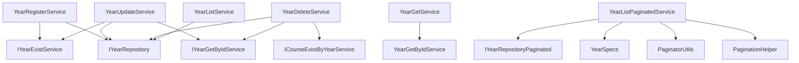

# Auditoría del módulo Admin Year

## Resumen ejecutivo
- **Dominio:** Gestión de años académicos (`/admin/years`)
- **Capas principales:** Controllers → Services → Repositories/Specs → Utils (`PaginatorUtils`, `PaginationHelper`) → Responses
- **Objetivo de pruebas unitarias:** Validar reglas de negocio, manejo de excepciones y orquestación entre componentes antes de escribir las suites.

## Casos de uso cubiertos por el módulo
- **CU7 – Registrar año:** `YearRegisterController` → `YearRegisterService`
- **CU8 – Listar años activos:** `YearListController` → `YearListService`
- **CU10 – Actualizar año:** `YearUpdateController` → `YearUpdateService`
- **CU11 – Eliminar año:** `YearDeleteController` → `YearDeleteService`
- **CU12 – Listado paginado:** `YearListPaginatedController` → `YearListPaginatedService`
- **CU13 – Obtener año por id:** `YearGetController` → `YearGetService`

## Diagrama de dependencias de servicios

## Validaciones y excepciones críticas a cubrir
- **DTOs (`YearRequestDto`, `YearUpdateRequestDto`):**
  - `@NotEmpty`, `@Size(max = 50)` y `@Pattern` restringen el campo `name`. Las pruebas deben simular DTOs válidos/ inválidos y comprobar que los servicios no sobrepasan estas reglas (p. ej. no manipulan nombres vacíos).

- **`YearRegisterService`:**
  - Llama a `IYearExistService.validate(name)` y lanza `ConflictException` con `ConflictExceptionMessages.resourceAlreadyExistsByName`.
  - Happy path persiste con `IYearRepository.save`.

- **`YearUpdateService`:**
  - Obtiene entidad con `IYearGetByIdService.findById` -> posible `NotFoundException`.
  - `IYearExistService.validateExceptId(name, id)` lanza `ConflictException`.
  - Actualiza campo `name` y guarda; no recrea entidad, lo que obliga a verificar mutación in-place.

- **`YearDeleteService`:**
  - Convierte el `id` a `Long`; si falla lanza `BadRequestException` (`BadRequestExceptionMessages.invalidFormat`).
  - Rechaza eliminaciones repetidas (`year.getDeletedAt() != null`) con `BadRequestException` reutilizando mensaje de `ConflictExceptionMessages.resourceAlreadyDeleted`.
  - Consulta `ICourseExistByYearService.validate(year)`; si hay cursos asociados lanza `ConflictException` (`resourceDeletionNotAllowedDueToAssociations`).
  - Marca borrado lógico (`Year.delete()`) y persiste.

- **`YearGetService`:** Delegación directa a `YearGetByIdService`; pruebas deben validar mapeo correcto con `YearMapper.toDto`.

- **`YearListService`:** Usa `IYearRepository.findAllByDeletedAtIsNull`; pruebas deben verificar filtrado y transformación a DTO mediante `YearMapper.toListDto`.

- **`YearListPaginatedService`:**
  - Genera `Pageable` con `PaginatorUtils.buildPageable`.
  - Arma especificación base `YearSpecs.notDeleted()`, añade `nameContains` y `genericFilter`.
  - `YearSpecs.genericFilter` debe ignorar silenciosamente filtros inválidos (retorna `cb.conjunction()`).
  - Crea `PaginatedData` con `PaginationHelper.fromPage`.

- **Servicios comunes:**
  - `YearExistService.validate(name)` → boolean simple; `validateExceptId` lanza `ConflictException` cuando existe otro registro.
  - `YearGetByIdService.findById` lanza `NotFoundException` (`NotFoundExceptionMesagges.resourceNotFoundById`) si no encuentra entidad.

- **Modelo `Year`:**
  - Métodos `delete()` y `restore()` mutan `deletedAt`; pruebas deben asegurar consistencia temporal y revertibilidad.

## Consideraciones adicionales para pruebas
- **Dependencias externas a mockear:**
  - `IYearRepository`, `IYearRepositoryPaginated`, `ICourseExistByYearService`, `IYearGetByIdService`, `PaginatorUtils`, `PaginationHelper`, `YearSpecs` (solo combinaciones mediante `Specification`).
- **Mensajes de error:** Usan factorías centralizadas (`ConflictExceptionMessages`, `BadRequestExceptionMessages`, etc.), por lo que las aserciones deben enfocarse en el tipo de excepción y mensaje exacto.
- **Roles y anotaciones:** `@SessionRequired` se valida en capas superiores; no se cubre en pruebas unitarias de servicios pero es relevante para pruebas de controladores/mocking.
- **Persistencia lógica:** No se realiza borrado físico; la cobertura debe asegurarse de que `yearRepository.save` recibe entidad con `deletedAt` poblado o nulo según corresponda.

---

Este análisis servirá como base para la estrategia de pruebas unitarias, asegurando que ningún flujo crítico quede sin cobertura.

