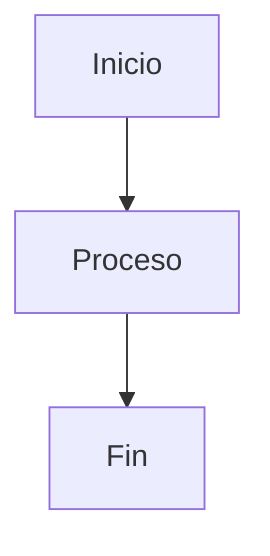

# Markdown Renderer & Task Visualizer Tools

## Markdown Renderer

Esta herramienta permite convertir archivos Markdown a HTML con renderizado completo de diagramas Mermaid y otros elementos, abriéndose automáticamente en el navegador.

### Características

- ✅ Conversión completa de Markdown a HTML usando `markdown-it`
- ✅ Renderizado automático de diagramas Mermaid
- ✅ Estilos CSS modernos y responsivos
- ✅ Apertura automática en el navegador predeterminado
- ✅ Soporte para código resaltado, tablas, listas, enlaces, etc.

### Uso

#### Comando NPM (recomendado)

```bash
npm run render-md <ruta-al-archivo-markdown>
```

#### Ejemplos

```bash
# Renderizar un archivo en la raíz del proyecto
npm run render-md README.md

# Renderizar un archivo en subcarpetas
npm run render-md docs/diagrams/architecture.md
npm run render-md docs/feature_brief.md

# Usando Node.js directamente
node tools/markdown-renderer.js docs/diagrams/architecture.md
```

## Task Visualizer 🚀

Herramienta para visualizar dinámicamente el progreso de tareas del proyecto desde `docs/tasks.json` con actualizaciones en tiempo real.

### Características

- ✅ Lectura automática de `docs/tasks.json`
- ✅ Interfaz moderna con gradientes y animaciones
- ✅ Estadísticas de progreso y barra de progreso
- ✅ Actualización automática cada 5 segundos
- ✅ Animaciones para tareas completadas
- ✅ Resaltado de la tarea actual
- ✅ Diseño responsivo para móviles
- ✅ Agrupación visual por estado (Completadas/Pendientes)

### Uso

#### Comando NPM (recomendado)

```bash
npm run view-tasks
```

#### Ejemplo de uso

```bash
# Abrir el visualizador de tareas en el navegador
npm run view-tasks

# El visualizador se abrirá automáticamente y se actualizará cada 5 segundos
```

### Funcionalidades

- **Estadísticas en tiempo real**: Total de tareas, completadas, porcentaje de progreso
- **Tarjetas de tareas animadas**: Descripción completa, criterios de aceptación, parámetros
- **Progreso visual**: Barra de progreso con transiciones suaves
- **Actualización inteligente**: Detecta cambios en `tasks.json` sin recargar la página
- **Navegación fluida**: Scroll automático a la tarea actual con highlight temporal
- **Optimización**: Pausa polling cuando la pestaña no está visible

### Archivos generados

- `temp_task_visualizer.html`: Archivo HTML temporal con la interfaz dinámica
- Se actualiza automáticamente cada 5 segundos leyendo `docs/tasks.json`

### Personalización

El visualizador lee automáticamente el título del proyecto desde `docs/tasks.json` (`feature_title`) y lo muestra en el header.

---

## Sintaxis Mermaid

Para incluir diagramas Mermaid en tus archivos Markdown, usa bloques de código con el lenguaje `mermaid`:

````markdown

````

## Archivos de ejemplo

El proyecto incluye varios archivos Markdown que puedes usar para probar:

- `README.md` - Documentación básica del proyecto
- `docs/diagrams/architecture.md` - Arquitectura del sistema con diagrama Mermaid
- `docs/diagrams/*.md` - Otros diagramas del sistema
- `docs/feature_brief.md` - Requisitos del proyecto

## Cómo funciona

### Markdown Renderer
1. El script lee el archivo Markdown especificado
2. Convierte el contenido a HTML usando `markdown-it`
3. Detecta bloques de código Mermaid y los marca especialmente
4. Genera un archivo HTML completo con estilos CSS y scripts
5. Incluye Mermaid.js desde CDN para renderizar diagramas
6. Abre el archivo HTML en tu navegador predeterminado

### Task Visualizer
1. Lee `docs/tasks.json` para obtener datos de tareas
2. Genera HTML dinámico con estilos modernos y JavaScript interactivo
3. Crea `temp_task_visualizer.html` con polling cada 5 segundos
4. Abre automáticamente en el navegador
5. Actualiza contenido sin recargar la página usando Fetch API

## Dependencias

El script utiliza las siguientes librerías ya incluidas en el proyecto:

- `markdown-it` - Conversión Markdown a HTML
- `mermaid` - Renderizado de diagramas

## Notas técnicas

- Los archivos HTML temporales se crean en la raíz del proyecto
- El script es compatible con Windows, macOS y Linux
- Los diagramas Mermaid se renderizan automáticamente al cargar la página
- Los estilos están optimizados para legibilidad y presentación moderna
- El task visualizer usa polling eficiente que se pausa cuando la pestaña no está visible
- No requiere servidor web - funciona completamente en el cliente moderno

---

**Comandos disponibles:**
- `npm run render-md <archivo>` - Renderizar Markdown con diagramas
- `npm run view-tasks` - Visualizar progreso de tareas en tiempo real
